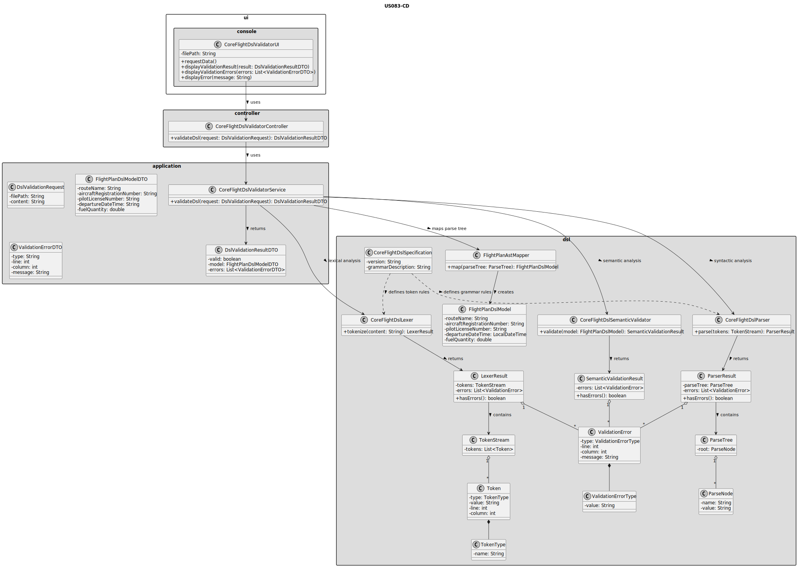
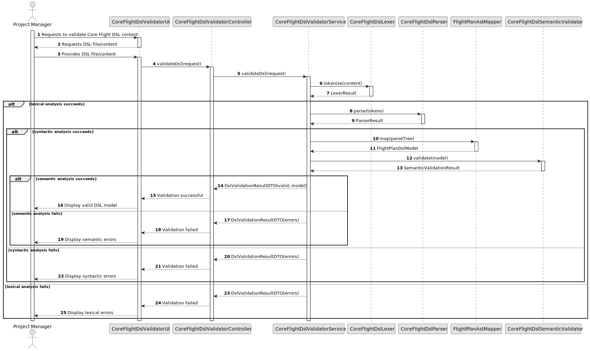

# US083 - Core Flight DSL

## 3. Design

### 3.1. Responsibility Assignment

The Core Flight DSL validation process is divided between the following components:

* **CoreFlightDslSpecification:** documents or represents the grammar and valid structure of the DSL.
* **CoreFlightDslValidatorUI:** allows testing or validating DSL content.
* **CoreFlightDslValidatorController:** receives validation requests.
* **CoreFlightDslValidatorService:** coordinates lexical, syntactic and semantic validation.
* **CoreFlightDslLexer:** performs lexical analysis.
* **CoreFlightDslParser:** performs syntactic analysis.
* **FlightPlanAst:** represents the parsed flight plan structure.
* **FlightPlanAstMapper:** maps the parse tree/AST into an internal flight plan representation.
* **CoreFlightDslSemanticValidator:** performs semantic analysis.
* **ValidationError:** represents lexical, syntactic or semantic validation errors.
* **ValidationResult:** represents the result of the complete DSL validation process.
* **FlightPlanDslModel:** internal representation of the flight plan extracted from the DSL.

---

### 3.2. Class Diagram

---

### 3.3. Sequence Diagram

---

### 3.4. Applied Patterns

* **Lexer/Parser:** separates lexical and syntactic validation.
* **AST / Internal Model:** represents the flight plan structure extracted from the DSL.
* **Semantic Validator:** separates grammar correctness from domain correctness.
* **Mapper:** converts parser output into application-level representation.
* **DTO:** transfers validation results and errors.
* **Error Reporting:** provides meaningful validation feedback.

---

### 3.5. Design Remarks

* The lexer should only be responsible for tokenization.
* The parser should only be responsible for grammar validation.
* The semantic validator should verify domain meaning and references.
* The DSL validation process should not persist flight plans.
* US081 should reuse this validation pipeline before importing a flight plan.
* Error messages should include enough information to help locate and correct the issue.