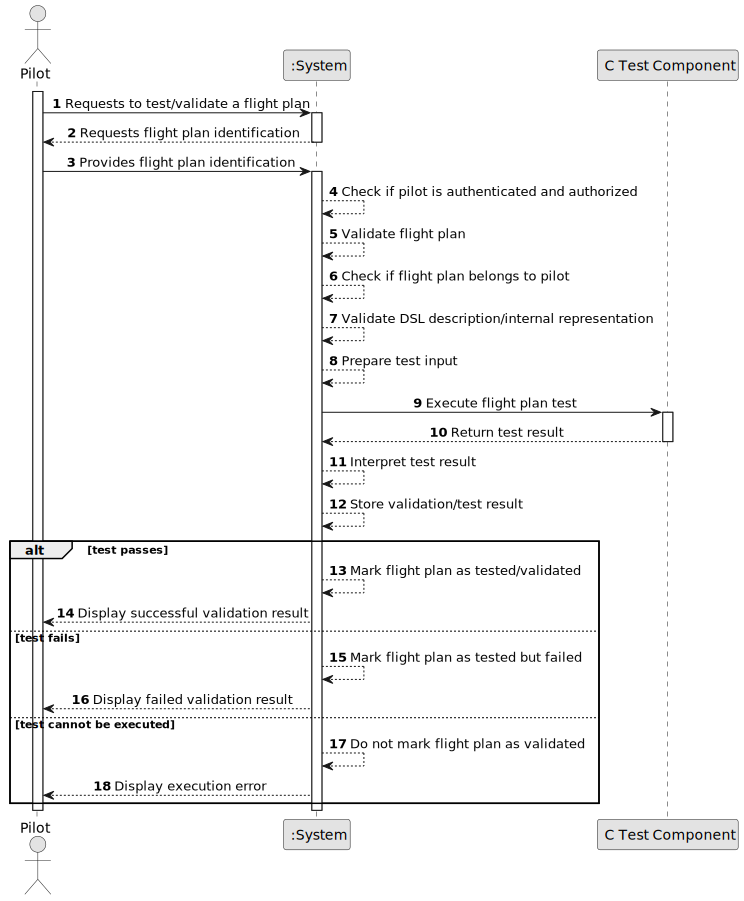

# US085 - Test/Validate Flight Plan

## 1. Requirements Engineering

### 1.1. User Story Description

As a Pilot, I want to test/validate a flight I've made.

This functionality allows an authenticated and authorized Pilot to test and validate one of their flight plans. The validation must include the validation of the flight plan described using the DSL and the execution of a test component.

The test component must be implemented in the C language. The test should verify whether the flight plan is safe and valid according to the system's operational rules, including fuel sufficiency and minimum altitude requirements.

---

### 1.2. Customer Specifications and Clarifications

**From the specifications document:**

* A Pilot can test/validate a flight they have made.
* The validation must include validation of the flight plan described using the DSL.
* The validation must include the flight plan test.
* The test component must be implemented in the C language.
* The objective of testing a flight is to verify if the aircraft carries enough fuel.
* The objective of testing a flight is also to verify if the aircraft meets the minimum altitude requirements.
* The minimum quantity of fuel is the quantity of fuel in the aircraft at the end of the flight required by the air control area of the flight destination airport.
* Authentication and authorization must be enforced for all users and functionalities.

**From the client clarifications:**

No additional client clarifications are currently available.

---

### 1.3. Acceptance Criteria

* **AC1:** A Pilot must be able to test/validate one of their flight plans.
* **AC2:** The Pilot must be authenticated.
* **AC3:** The Pilot must be authorized to test/validate the selected flight plan.
* **AC4:** The selected flight plan must exist.
* **AC5:** The selected flight plan must belong to the authenticated Pilot.
* **AC6:** The flight plan must have a DSL description or an internal representation produced from the DSL.
* **AC7:** The DSL description/internal representation must be valid before the flight test is executed.
* **AC8:** The validation must include the flight plan described using the DSL.
* **AC9:** The validation must include execution of the flight test component.
* **AC10:** The flight test component must be implemented in the C language.
* **AC11:** The test must verify that the aircraft carries enough fuel.
* **AC12:** The test must verify that the aircraft respects minimum altitude requirements.
* **AC13:** The test must verify that the final fuel quantity is at least the minimum required by the destination airport's air control area.
* **AC14:** If the test succeeds, the flight plan test result must be stored as valid/passed.
* **AC15:** If the test fails, the flight plan test result must be stored as invalid/failed.
* **AC16:** The test result must include meaningful details explaining the validation outcome.
* **AC17:** If the flight plan has weather data, the test must use the current weather data associated with the flight plan.
* **AC18:** If previous test results were voided by weather data changes, a new test must replace the voided result as the current result.
* **AC19:** The system must not mark a flight plan as validated if the C test component fails or cannot be executed.
* **AC20:** The system must display a success message when validation is completed.
* **AC21:** The system must display an error message when validation cannot be executed.

---

### 1.4. Found out Dependencies

* This user story depends on US030, because authentication and authorization must be enforced.
* This user story depends on US075, because the actor is a Pilot and a Pilot is a system user.
* This user story depends on US080, because a flight plan must exist before it can be tested.
* This user story depends on US081, if the flight plan was created from a file.
* This user story depends on US083, because the validation must include the flight plan described using the DSL.
* This user story is related to US082, because changing weather data can void previous test results.
* This user story is related to US086, because Pilot user stories must be remotely available.
* This user story is related to later simulation user stories, because successful flight plan validation may be a prerequisite for simulation.

---

### 1.5. Input and Output Data

**Input Data:**

* Selected data:
    * Flight plan to test/validate

**Implicit data used by the test:**

* Flight plan DSL description or internal representation
* Route and airport data
* Aircraft model data
* Aircraft performance data
* Fuel quantity
* Destination air control area requirements
* Minimum final fuel quantity
* Minimum altitude requirements
* Weather data, if associated with the flight plan

**Output Data:**

* In case validation is completed:
    * Validation/test result
    * Pass/fail status
    * Fuel validation details
    * Altitude validation details
    * Error/warning messages, if any

* In case validation cannot be executed:
    * Error message explaining why the validation could not be performed

---

### 1.6. System Sequence Diagram

**_Other alternatives might exist._**

---

### 1.7. Other Relevant Remarks

* This user story should not duplicate the DSL validation pipeline; it should reuse it.
* The C test component should receive a clear input representation and return a structured result.
* A failed test is not the same as a technical failure to execute the test.
* If the C component cannot execute, the flight plan must not be marked as validated.
* Weather changes after a test should void the previous test, as defined in US082.