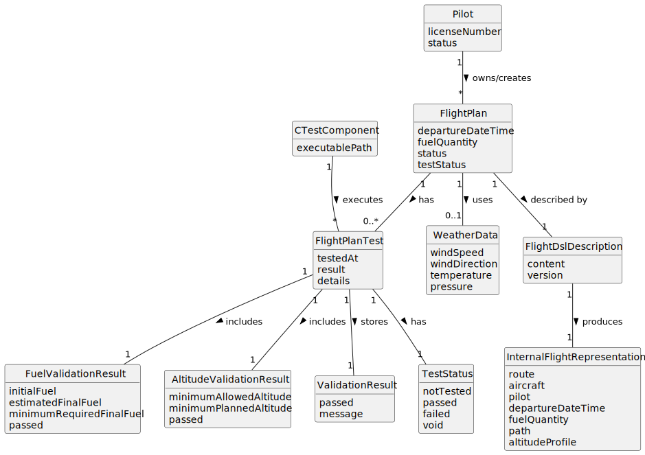

# US085 - Test/Validate Flight Plan

## 2. Analysis

### 2.1. Relevant Domain Concepts

The relevant domain concepts for this user story are:

* **Pilot:** system user who created or owns the flight plan.
* **Flight Plan:** planned flight to be tested and validated.
* **Flight DSL Description:** formal description of the flight plan.
* **Internal Flight Representation:** validated representation produced from the DSL.
* **Flight Plan Test:** test execution used to determine whether the flight plan is valid.
* **C Test Component:** external/native component implemented in C and responsible for executing the flight plan test.
* **Fuel Validation:** check that verifies whether the aircraft carries enough fuel.
* **Minimum Final Fuel:** quantity of fuel that must remain at the end of the flight according to the destination air control area.
* **Altitude Validation:** check that verifies whether the flight respects minimum altitude requirements.
* **Weather Data:** meteorological data associated with the flight plan, if any.
* **Validation Result:** structured outcome of the flight plan test.
* **Test Status:** indicates whether the flight plan is not tested, passed, failed or void.

---

### 2.2. Business Rules

* Only an authenticated and authorized Pilot can test/validate their flight plans.
* The selected flight plan must exist.
* The selected flight plan must belong to the authenticated Pilot.
* The flight plan DSL description or internal representation must be valid before the test is executed.
* The test component must be implemented in C.
* The test must verify fuel sufficiency.
* The test must verify minimum altitude requirements.
* The final fuel quantity must be at least the minimum quantity required by the destination airport's air control area.
* Weather data associated with the flight plan must be considered by the test when present.
* If the C test component returns a passing result, the flight plan may be marked as tested/validated.
* If the C test component returns a failing result, the flight plan must be marked as tested but failed.
* If the C test component cannot be executed, the flight plan must not be marked as validated.
* The test result must be stored with meaningful details.
* A new successful or failed test result becomes the current test result.
* Previously voided test results should remain stored for history.

---

### 2.3. Preconditions

* The Pilot must be authenticated.
* The Pilot must be authorized to test/validate flight plans.
* The selected flight plan must exist.
* The selected flight plan must belong to the authenticated Pilot.
* The flight plan must have a valid DSL description or valid internal representation.
* The C test component must be available for execution.

---

### 2.4. Postconditions

**Successful validation/pass:**

* The C test component is executed.
* A passing test result is stored.
* The flight plan is marked as tested/validated.
* The validation result includes relevant fuel and altitude details.

**Completed validation/fail:**

* The C test component is executed.
* A failing test result is stored.
* The flight plan is marked as tested but failed.
* The validation result includes the failure reasons.

**Execution failure:**

* No pass/fail validation result is stored as current.
* The flight plan is not marked as validated.
* An execution error is displayed.

---

### 2.5. Domain Model

