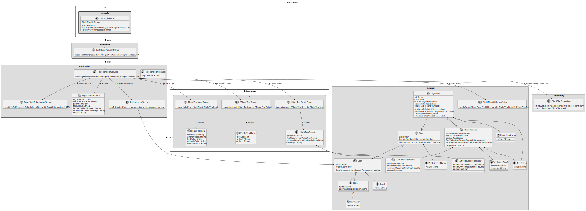
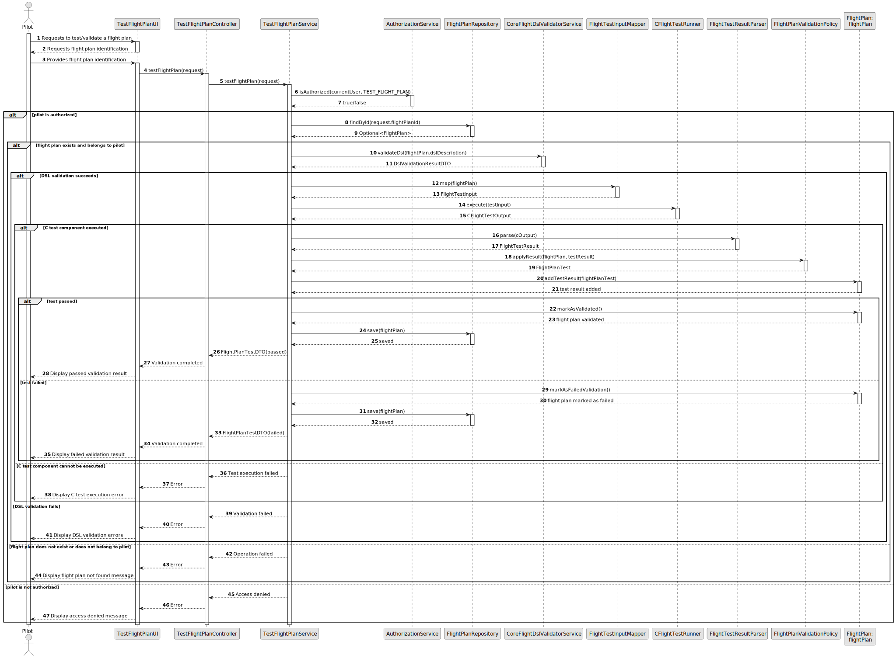

# US085 - Test/Validate Flight Plan

## 3. Design

### 3.1. Responsibility Assignment

The flight plan test/validation process is divided between the following components:

* **TestFlightPlanUI:** interacts with the Pilot and collects the selected flight plan.
* **TestFlightPlanController:** receives the validation request from the UI.
* **TestFlightPlanService:** coordinates authorization, flight plan lookup, DSL validation, C test execution and result persistence.
* **AuthorizationService:** verifies if the current user has permission to test flight plans.
* **FlightPlanRepository:** retrieves and stores the flight plan.
* **CoreFlightDslValidatorService:** validates the DSL description/internal representation.
* **FlightTestInputMapper:** prepares the input expected by the C test component.
* **CFlightTestRunner:** executes the C test component.
* **FlightTestResultParser:** parses the C component output.
* **FlightPlan:** domain entity that stores current test status and test history.
* **FlightPlanTest:** domain entity representing a test execution result.
* **FlightPlanValidationPolicy:** domain policy responsible for deciding how test results affect the flight plan status.

---

### 3.2. Class Diagram

---

### 3.3. Sequence Diagram

---

### 3.4. Applied Patterns

* **UI:** responsible for collecting input from the Pilot.
* **Controller:** receives and delegates the request.
* **Service:** coordinates the validation workflow.
* **Repository:** abstracts flight plan persistence.
* **External Component Adapter:** isolates execution of the C test component.
* **Mapper:** converts domain flight plan data into C test input.
* **Parser:** converts C test output into application-level results.
* **Entity:** represents flight plans and test results.
* **Domain Policy:** centralizes rules for updating test status.
* **DTO:** transfers validation results to the UI.

---

### 3.5. Design Remarks

* The C test component should be called through an adapter such as `CFlightTestRunner`.
* Java/domain code should not depend directly on low-level process execution details.
* The system should distinguish between a failed validation and failure to execute the C component.
* The DSL validation pipeline from US083 should be reused.
* The flight plan should preserve previous test results, including voided results.
* The current test status should reflect the most recent non-void test result.