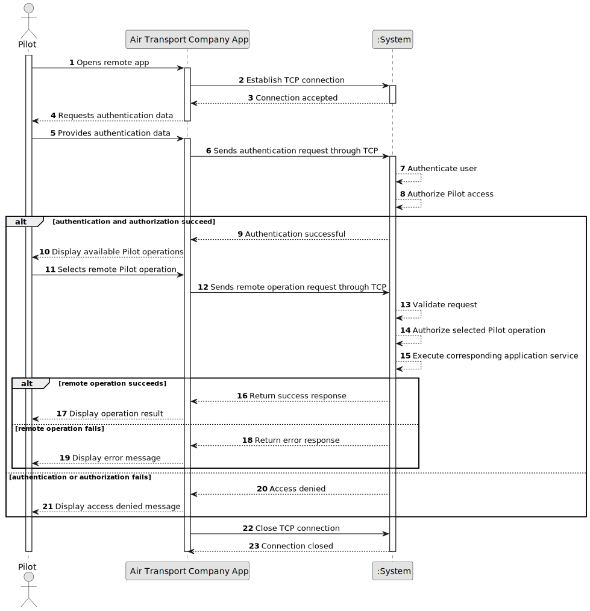

# US086 - Pilot Remote Access

## 1. Requirements Engineering

### 1.1. User Story Description

As a Pilot, I want to remotely access the system using the Air Transport Company App.

This functionality allows a Pilot to access the system remotely through a specific TCP-based client application. The client must communicate with a server application embedded in the system. The client must not interact directly with the database.

All Pilot user stories must be remotely available through this client application. Authentication and authorization must be enforced for every protected operation.

---

### 1.2. Customer Specifications and Clarifications

**From the specifications document:**

* A Pilot wants to remotely access the system using the Air Transport Company App.
* A specific TCP-based network client application is required.
* The TCP client application must communicate with the server application embedded in the system.
* The client application interaction with the system must be limited to the TCP connection.
* Direct interaction with the database is unacceptable.
* All Pilot user stories must be remotely available by using this client application.
* Authentication and authorization must be enforced.

**From the client clarifications:**

No additional client clarifications are currently available.

---

### 1.3. Acceptance Criteria

* **AC1:** A Pilot must be able to remotely access the system using the Air Transport Company App.
* **AC2:** The Air Transport Company App must be a specific TCP-based network client application.
* **AC3:** The TCP client must communicate with a server application embedded in the system.
* **AC4:** The client application must interact with the system only through the TCP connection.
* **AC5:** The client application must not directly access the database.
* **AC6:** Authentication must be enforced before accessing protected Pilot operations.
* **AC7:** Authorization must be enforced for each remote Pilot operation.
* **AC8:** All Pilot user stories must be available remotely through the client application.
* **AC9:** Remote Pilot operations must use the same application services as local operations whenever possible.
* **AC10:** The server must return success responses for valid requests.
* **AC11:** The server must return meaningful error responses for invalid requests.
* **AC12:** The server must reject unsupported or malformed requests gracefully.
* **AC13:** The TCP connection must be closed safely when the client exits or when an unrecoverable error occurs.
* **AC14:** A remote Pilot must only access flight plans and operations for which they are authorized.
* **AC15:** Remote access must not bypass any business rule from the corresponding Pilot user stories.

---

### 1.4. Found out Dependencies

* This user story depends on US030, because authentication and authorization must be enforced.
* This user story depends on US075, because a Pilot is a system user.
* This user story depends on the Pilot user stories that must be exposed remotely:
    * US080 - Create a flight plan
    * US081 - Create a flight plan from a file
    * US082 - Insert weather data in a flight
    * US085 - Test/validate flight plan
* This user story is related to US078, because both use the Air Transport Company App and the same TCP-based client/server approach.
* This user story is related to US083, because remote import or validation of flight plans may use the Flight DSL validation pipeline.

---

### 1.5. Input and Output Data

**Input Data:**

* Authentication data:
    * User credentials or authentication token

* Remote request data:
    * Operation identifier
    * Request payload required by the selected Pilot user story

**Output Data:**

* In case of success:
    * Success response
    * Requested data or operation result

* In case of failure:
    * Error response explaining why the remote operation failed

---

### 1.6. System Sequence Diagram

**_Other alternatives might exist._**

---

### 1.7. Other Relevant Remarks

* This user story is mainly an access and communication user story.
* The same Air Transport Company App can support both Air Transport Company Collaborator and Pilot flows, as long as authorization controls available operations.
* The remote app should not duplicate domain logic.
* The server should route remote requests to the same application services used by local UI flows.
* The TCP client must never bypass the system by connecting directly to repositories or the database.
* The remote protocol should be simple, documented and testable.