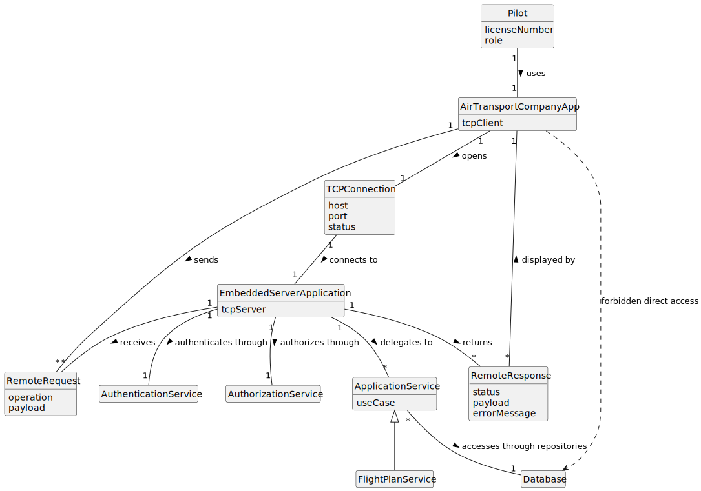

# US086 - Pilot Remote Access

## 2. Analysis

### 2.1. Relevant Domain Concepts

The relevant domain concepts for this user story are:

* **Pilot:** system user that remotely accesses the system.
* **Air Transport Company App:** TCP-based client application used by the Pilot.
* **Embedded Server Application:** server component embedded in the system and responsible for receiving TCP requests.
* **TCP Connection:** network communication channel between the client app and the server application.
* **Remote Request:** message sent by the client app to authenticate or execute a Pilot operation.
* **Remote Response:** message returned by the server application to the client app.
* **Authentication:** process of verifying the identity of the remote Pilot.
* **Authorization:** process of verifying whether the authenticated Pilot can execute the requested operation.
* **Application Service:** internal service that implements a Pilot use case.
* **Database:** persistence layer that must not be accessed directly by the client app.

---

### 2.2. Business Rules

* The Pilot must access the system remotely through the Air Transport Company App.
* The Air Transport Company App must communicate with the system through TCP.
* The system must include a server application capable of receiving TCP requests.
* The client app must not directly access the database.
* All remote operations must be performed through server-side application services.
* Authentication must be enforced before protected operations are available.
* Authorization must be enforced for each remote operation.
* All Pilot user stories must be available remotely.
* Remote access must not bypass existing domain rules.
* Remote access must not duplicate business logic in the client application.
* Invalid, unsupported or malformed requests must produce meaningful error responses.
* The Pilot must only access flight plans and operations they are authorized to access.

---

### 2.3. Preconditions

* The server application must be running and listening for TCP connections.
* The Air Transport Company App must be able to establish a TCP connection.
* The user must have valid Pilot credentials.
* The user must have the Pilot role.
* The requested operation must be supported by the remote protocol.

---

### 2.4. Postconditions

**Successful remote access:**

* The TCP connection is established.
* The Pilot is authenticated.
* The Pilot is authorized.
* The selected remote operation is executed through the system's application services.
* The client app receives and displays the server response.

**Failed remote access:**

* The operation is not executed.
* No direct database access occurs.
* A meaningful error response is returned whenever possible.
* The TCP connection is closed safely if required.

---

### 2.5. Domain Model

