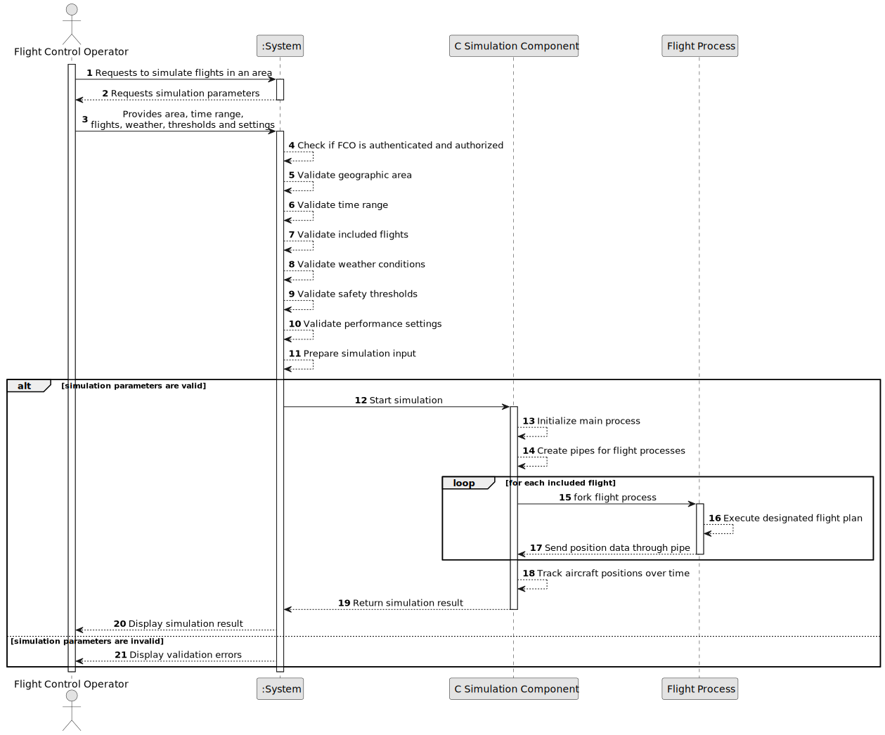

# US100 - Simulate Flights in a Given Area

## 1. Requirements Engineering

### 1.1. User Story Description

As a Flight Control Operator, I want to simulate flights in a given area.

This functionality allows an authenticated and authorized Flight Control Operator to start a flight simulation for a selected geographic area. The simulation includes several parameters, such as time range, geographic area, included flights, weather conditions, safety thresholds and performance settings.

The simulation component must be implemented in C and must use operating system mechanisms such as processes, pipes and signals. The main simulation process should fork a new process for each flight. Each flight process executes its designated flight plan and communicates with the main process through pipes. The main process tracks aircraft positions over time using an appropriate data structure.

---

### 1.2. Customer Specifications and Clarifications

**From the specifications document:**

* A Flight Control Operator can simulate flights in a given area.
* Simulations have many parameters, such as:
    * time range;
    * geographic area;
    * included flights;
    * weather conditions;
    * safety thresholds;
    * performance settings.
* All required parameters should be validated.
* This component must be implemented in C.
* This component must utilize processes, pipes and signals.
* The system should fork a new process for each flight.
* Each flight process should execute its designated flight plan.
* Pipes should facilitate communication between the main process and each flight process.
* The main process should track aircraft positions over time using an appropriate data structure.

**From the client clarifications:**

No additional client clarifications are currently available.

---

### 1.3. Acceptance Criteria

* **AC1:** A Flight Control Operator must be able to start a flight simulation in a given area.
* **AC2:** The Flight Control Operator must be authenticated.
* **AC3:** The Flight Control Operator must be authorized to simulate flights.
* **AC4:** The simulation must require a geographic area.
* **AC5:** The selected geographic area must exist or be valid.
* **AC6:** The simulation must require a time range.
* **AC7:** The time range must be valid.
* **AC8:** The simulation must include one or more flights or flight plans.
* **AC9:** Each included flight must have a designated flight plan.
* **AC10:** Included flight plans must be valid and executable by the simulation.
* **AC11:** Required weather conditions must be provided or retrievable.
* **AC12:** Safety thresholds must be provided and valid.
* **AC13:** Performance settings must be provided and valid.
* **AC14:** The simulation component must be implemented in C.
* **AC15:** The simulation must use processes.
* **AC16:** The simulation must use pipes.
* **AC17:** The simulation must use signals.
* **AC18:** The system must fork a new process for each simulated flight.
* **AC19:** Each flight process must execute its designated flight plan.
* **AC20:** Pipes must be used to communicate between the main process and each flight process.
* **AC21:** The main process must track aircraft positions over time.
* **AC22:** The main process must use an appropriate data structure to store aircraft positions.
* **AC23:** The system must display or return the simulation execution result.
* **AC24:** If the simulation cannot be started, the system must display a meaningful error message.
* **AC25:** If a child process fails, the main process must handle the failure safely.

---

### 1.4. Found out Dependencies

* This user story depends on US030, because authentication and authorization must be enforced.
* This user story depends on Flight Control Operator management user stories, because the actor must be a valid Flight Control Operator.
* This user story depends on US080, because simulations execute flight plans.
* This user story depends on US085, because only valid or testable flight plans should be simulated.
* This user story is related to US101, because flight processes must send movement commands/position updates to the main simulation process.
* This user story is related to US102, because aircraft safety violations are detected during simulation.
* This user story is related to US103, because simulation execution should progress using synchronized time steps.
* This user story is related to US105 and following simulation user stories, because they refine the simulation architecture using shared memory, threads and synchronization.
* This user story is related to US109 and US111, because simulation results are later used to generate reports.
* This user story is related to US113 and US114, because simulated flight progress may later be logged and visualized remotely.

---

### 1.5. Input and Output Data

**Input Data:**

* Selected data:
    * Geographic area
    * Included flights or flight plans
    * Weather conditions, if selected from existing records

* Typed data:
    * Simulation start time
    * Simulation end time
    * Safety thresholds
    * Performance settings

**Possible simulation parameters:**

* Time range
* Geographic area
* Included flight plans
* Weather conditions
* Minimum separation threshold
* Maximum allowed safety violations
* Simulation time step
* Performance settings
* Logging settings

**Output Data:**

* In case of success:
    * Simulation started/completed message
    * Simulation identifier, if applicable
    * Flight process execution status
    * Aircraft position tracking data
    * Simulation summary

* In case of failure:
    * Error message explaining why the simulation could not be started or completed

---

### 1.6. System Sequence Diagram

**_Other alternatives might exist._**

---

### 1.7. Other Relevant Remarks

* This user story establishes the base simulation engine.
* Later user stories refine movement capture, safety violation detection, synchronization and reporting.
* The simulation component must be written in C.
* Java/domain logic may prepare simulation input, but the process/pipes/signals simulation core belongs to the C component.
* The main process must be responsible for supervising child flight processes.