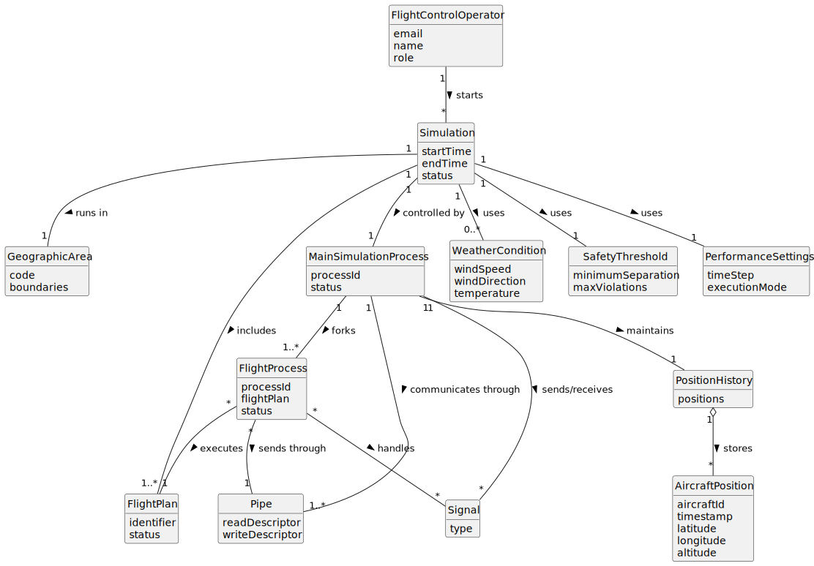

# US100 - Simulate Flights in a Given Area

## 2. Analysis

### 2.1. Relevant Domain Concepts

The relevant domain concepts for this user story are:

* **Flight Control Operator:** user who starts and controls the simulation.
* **Simulation:** execution of a set of flights in a given area and time range.
* **Geographic Area:** area where the simulation takes place.
* **Flight Plan:** planned flight execution used by each simulated flight process.
* **Included Flight:** flight selected to participate in the simulation.
* **Weather Conditions:** environmental conditions used during simulation.
* **Safety Threshold:** limit used to determine safe or unsafe flight situations.
* **Performance Settings:** simulation parameters affecting execution behaviour.
* **Main Simulation Process:** parent process responsible for starting and supervising flight processes.
* **Flight Process:** child process responsible for executing one flight plan.
* **Pipe:** communication mechanism between the main process and flight processes.
* **Signal:** process communication mechanism used for notifications and control.
* **Aircraft Position:** position of an aircraft at a given simulation instant.
* **Position Tracking Structure:** data structure used by the main process to store positions over time.

---

### 2.2. Business Rules

* Only an authenticated and authorized Flight Control Operator can start simulations.
* A simulation must have a valid geographic area.
* A simulation must have a valid time range.
* A simulation must include one or more flights or flight plans.
* All required simulation parameters must be validated before starting execution.
* Each included flight must have a designated executable flight plan.
* Weather conditions must be provided or available when required.
* Safety thresholds must be valid.
* Performance settings must be valid.
* The simulation component must be implemented in C.
* The simulation component must use processes.
* The simulation component must use pipes.
* The simulation component must use signals.
* The main process must fork a child process for each included flight.
* Each flight process must execute its designated flight plan.
* The main process and child processes must communicate through pipes.
* The main process must track aircraft positions over time.
* Child process failures must be handled safely by the main process.

---

### 2.3. Preconditions

* The Flight Control Operator must be authenticated.
* The Flight Control Operator must be authorized to simulate flights.
* The geographic area must be valid.
* The time range must be valid.
* Included flights or flight plans must be valid.
* Required weather conditions, thresholds and performance settings must be valid.
* The C simulation component must be available for execution.

---

### 2.4. Postconditions

**Successful simulation start/execution:**

* The C simulation component is started.
* A main simulation process is initialized.
* Pipes are created for communication.
* A child process is forked for each included flight.
* Each flight process executes its designated flight plan.
* Aircraft positions are tracked over time.
* A simulation result is produced.

**Failed simulation start:**

* No simulation is started.
* No flight process is forked.
* No simulation result is stored or returned as completed.
* Validation errors are displayed.

**Simulation execution failure:**

* The main process handles failures safely.
* The system returns or logs meaningful error information.
* Any required cleanup is performed.

---

### 2.5. Domain Model

