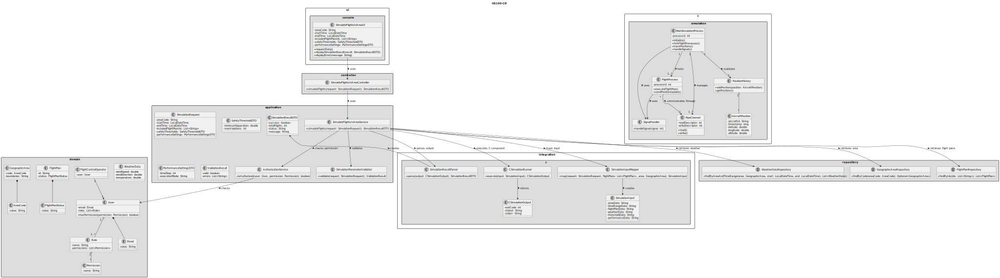
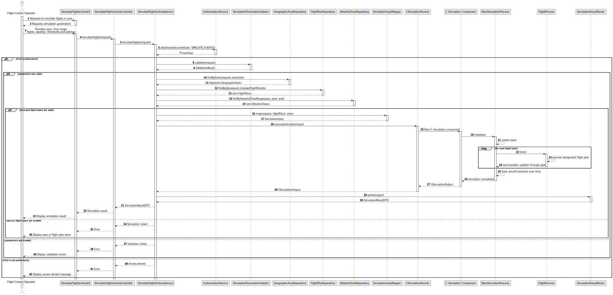

# US100 - Simulate Flights in a Given Area

## 3. Design

### 3.1. Responsibility Assignment

The flight simulation process is divided between the following components:

* **SimulateFlightsInAreaUI:** interacts with the Flight Control Operator and collects simulation parameters.
* **SimulateFlightsInAreaController:** receives the simulation request from the UI.
* **SimulateFlightsInAreaService:** coordinates authorization, parameter validation, flight plan lookup and simulation execution.
* **AuthorizationService:** verifies if the current user has permission to start simulations.
* **FlightPlanRepository:** retrieves the included flight plans.
* **GeographicAreaRepository:** retrieves or validates the selected geographic area.
* **WeatherDataRepository:** retrieves weather conditions when needed.
* **SimulationParameterValidator:** validates time range, area, flights, thresholds and settings.
* **SimulationRequest:** application request containing validated simulation parameters.
* **CSimulationRunner:** adapter responsible for invoking the C simulation component.
* **SimulationInputMapper:** maps application data into the input format expected by the C component.
* **SimulationResultParser:** parses the result returned by the C component.
* **SimulationResultDTO:** transports the simulation result to the UI.
* **C Simulation Component:** C program responsible for processes, pipes, signals and aircraft position tracking.
* **MainSimulationProcess:** parent process inside the C simulation component.
* **FlightProcess:** child process forked for each included flight.
* **PositionHistory:** data structure used by the main process to track aircraft positions over time.

---

### 3.2. Class Diagram

---

### 3.3. Sequence Diagram

---

### 3.4. Applied Patterns

* **UI:** responsible for collecting simulation parameters.
* **Controller:** receives and delegates the request.
* **Service:** coordinates authorization, validation and execution.
* **Repository:** retrieves required domain data.
* **Validator:** checks required simulation parameters before execution.
* **Adapter:** isolates Java/application code from the C simulation executable.
* **Mapper:** converts domain/application data into simulation input.
* **Parser:** converts simulation output into application-level result.
* **Process-per-flight:** each flight is executed by a dedicated child process.
* **Pipe-based IPC:** parent and child processes communicate using pipes.
* **Signal-based Control:** signals are used for process notifications and control.

---

### 3.5. Design Remarks

* The C component should be isolated behind `CSimulationRunner`.
* The Java/application layer should validate parameters before invoking the C component.
* The C component is responsible for forks, pipes, signals and internal position tracking.
* The main process should supervise child flight processes.
* The main process should maintain aircraft positions over time using an appropriate data structure.
* Later user stories will refine movement processing, violation detection, synchronization and reporting.