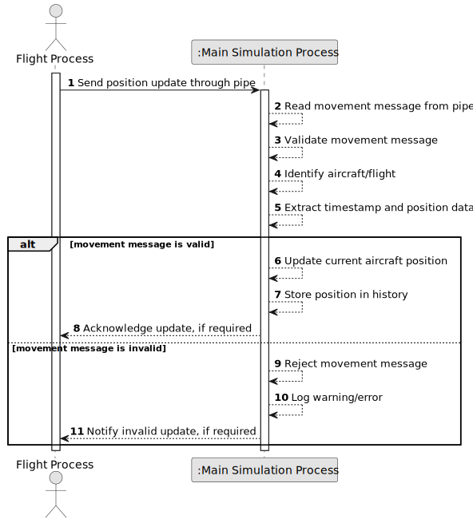

# US101 - Capture and Process Flight Movements

## 1. Requirements Engineering

### 1.1. User Story Description

As a simulation process, I want to receive movement commands from flight processes so that I can track aircraft positions over time.

This functionality allows the main simulation process to receive position updates from each flight process during simulation execution. Each flight process must send its position updates to the main process through a pipe.

The main process must process those updates, update the current aircraft positions and store past positions. This historical position data is needed to anticipate and detect potential safety violations in later simulation steps.

---

### 1.2. Customer Specifications and Clarifications

**From the specifications document:**

* Each flight process must send position updates to the main process via a pipe.
* The main process should track aircraft positions.
* The system must store past positions to anticipate and detect potential safety violations.
* The simulation component is implemented in C.
* The simulation uses processes, pipes and signals.
* The main process forks one process per flight.

**From the client clarifications:**

No additional client clarifications are currently available.

---

### 1.3. Acceptance Criteria

* **AC1:** Each flight process must send position updates to the main process.
* **AC2:** Position updates must be sent through a pipe.
* **AC3:** The main process must receive position updates from each flight process.
* **AC4:** The main process must validate received position update messages.
* **AC5:** Each position update must identify the aircraft or flight process.
* **AC6:** Each position update must include a simulation timestamp or time step.
* **AC7:** Each position update must include aircraft position data.
* **AC8:** Aircraft position data must include enough information to track the aircraft over time.
* **AC9:** The main process must update the current position of the aircraft after receiving a valid update.
* **AC10:** The main process must store past aircraft positions.
* **AC11:** Past positions must be stored in an appropriate data structure.
* **AC12:** Invalid or malformed movement messages must be handled safely.
* **AC13:** The system must not crash when a flight process sends an invalid update.
* **AC14:** Position history must be available for later safety violation detection.
* **AC15:** The movement processing component must be implemented in C as part of the simulation component.

---

### 1.4. Found out Dependencies

* This user story depends on US100, because the simulation must exist and flight processes must be forked before movement updates can be captured.
* This user story is related to US102, because stored past positions are used to anticipate and detect potential safety violations.
* This user story is related to US103, because position updates will later be synchronized by simulation time step.
* This user story is related to US105, because later simulation architecture introduces shared memory communication.
* This user story is related to US106, because later parent process threads may consume position data concurrently.
* This user story is related to US109 and US111, because position history may later appear in simulation reports.
* This user story is related to US113 and US114, because movement data may later be logged or visualized remotely.

---

### 1.5. Input and Output Data

**Input Data:**

* Movement messages received through pipes, including:
    * Flight identifier or aircraft identifier
    * Simulation timestamp or time step
    * Latitude
    * Longitude
    * Altitude
    * Optional velocity vector
    * Optional heading
    * Optional status

**Output Data:**

* In case of successful processing:
    * Updated current aircraft position
    * Stored position history entry

* In case of invalid update:
    * Rejected update
    * Error or warning log entry

---

### 1.6. System Sequence Diagram

**_Other alternatives might exist._**

---

### 1.7. Other Relevant Remarks

* This user story focuses on capturing and storing position updates.
* It does not yet define full safety violation detection; that belongs to US102.
* It does not yet define strict step synchronization; that belongs to US103.
* The chosen position history structure should support efficient access by aircraft and time.
* Invalid movement commands should be handled defensively.