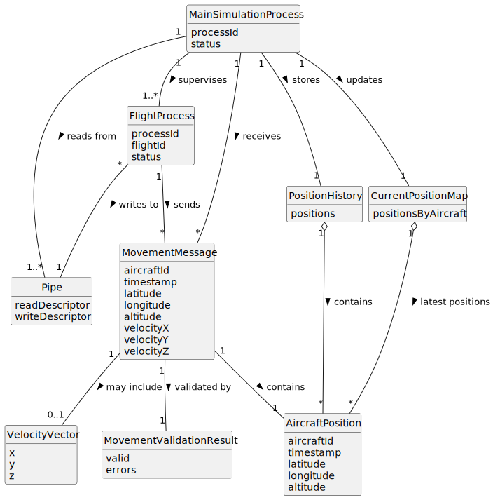

# US101 - Capture and Process Flight Movements

## 2. Analysis

### 2.1. Relevant Domain Concepts

The relevant domain concepts for this user story are:

* **Main Simulation Process:** parent process responsible for supervising flight processes and tracking aircraft positions.
* **Flight Process:** child process responsible for executing a specific flight plan.
* **Movement Command / Position Update:** message sent by a flight process to communicate aircraft movement.
* **Pipe:** inter-process communication mechanism used to send updates from flight processes to the main process.
* **Aircraft Position:** aircraft location at a given simulation timestamp.
* **Current Position:** latest known position of an aircraft.
* **Position History:** stored sequence of past aircraft positions.
* **Simulation Time Step:** time marker associated with a position update.
* **Movement Message Validation:** verification that received movement messages are valid and processable.
* **Safety Violation Detection:** later functionality that uses current and past positions.

---

### 2.2. Business Rules

* Each flight process must send position updates to the main process via pipe.
* The main process must read movement messages from each flight process pipe.
* The main process must validate received movement messages.
* A valid position update must identify the aircraft or flight.
* A valid position update must include simulation time information.
* A valid position update must include position data.
* The main process must update the current aircraft position after receiving a valid update.
* The main process must store past positions.
* Position history must be available for later safety violation detection.
* Invalid movement messages must not crash the simulation.
* Invalid movement messages should be logged or reported.

---

### 2.3. Preconditions

* A simulation must be running.
* The main simulation process must be active.
* At least one flight process must have been forked.
* A pipe between each flight process and the main process must exist.
* Each flight process must be able to calculate or provide position updates.

---

### 2.4. Postconditions

**Successful movement processing:**

* The position update is read from the pipe.
* The movement message is validated.
* The aircraft's current position is updated.
* The position update is stored in the position history.

**Invalid movement message:**

* The movement message is rejected.
* Current position is not updated from invalid data.
* Position history is not polluted with invalid data.
* A warning or error is logged.

**Communication failure:**

* The main process handles the pipe read failure safely.
* The affected flight process may be marked as failed or unavailable.
* The simulation does not crash unexpectedly.

---

### 2.5. Domain Model

