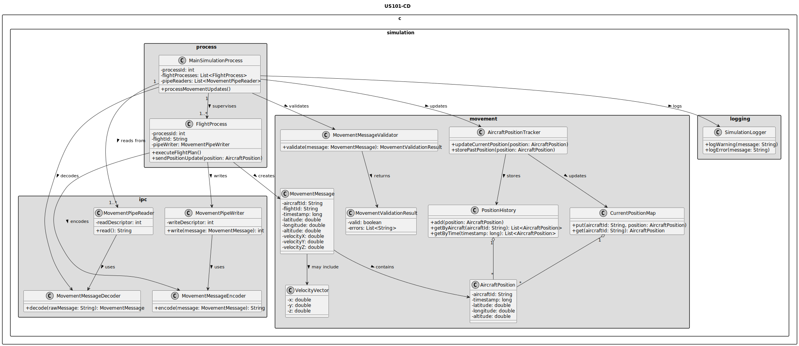
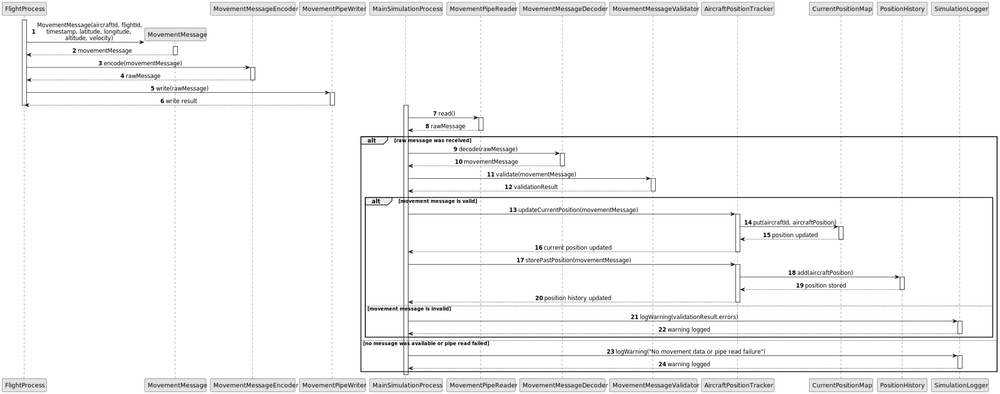

# US101 - Capture and Process Flight Movements

## 3. Design

### 3.1. Responsibility Assignment

The movement capture and processing flow is divided between the following components:

* **FlightProcess:** computes or obtains aircraft movement data while executing its flight plan.
* **MovementMessage:** represents a position update sent by a flight process.
* **MovementMessageEncoder:** serializes movement data so it can be sent through a pipe.
* **MovementPipeWriter:** writes movement messages from a flight process to its pipe.
* **MainSimulationProcess:** receives and processes movement messages from flight processes.
* **MovementPipeReader:** reads movement messages from flight process pipes.
* **MovementMessageDecoder:** converts raw pipe data into movement messages.
* **MovementMessageValidator:** validates received movement messages.
* **AircraftPositionTracker:** updates current aircraft positions.
* **PositionHistory:** stores past positions over time.
* **CurrentPositionMap:** stores the latest known position per aircraft.
* **MovementProcessingResult:** represents the result of processing an update.

---

### 3.2. Class Diagram

---

### 3.3. Sequence Diagram

---

### 3.4. Applied Patterns

* **Inter-Process Communication:** flight processes communicate with the main process through pipes.
* **Message Encoder/Decoder:** movement updates are serialized and deserialized.
* **Validator:** validates movement messages before they affect simulation state.
* **Tracker:** centralizes aircraft position tracking.
* **History Store:** preserves past positions for later analysis.
* **Defensive Processing:** invalid movement messages are rejected safely.

---

### 3.5. Design Remarks

* The main process should not trust raw pipe data.
* Each movement message should be validated before updating current positions.
* Position history should be organized by aircraft and timestamp or time step.
* Invalid messages should be logged and ignored.
* This user story prepares the data required by US102.
* Step synchronization is intentionally left to US103.