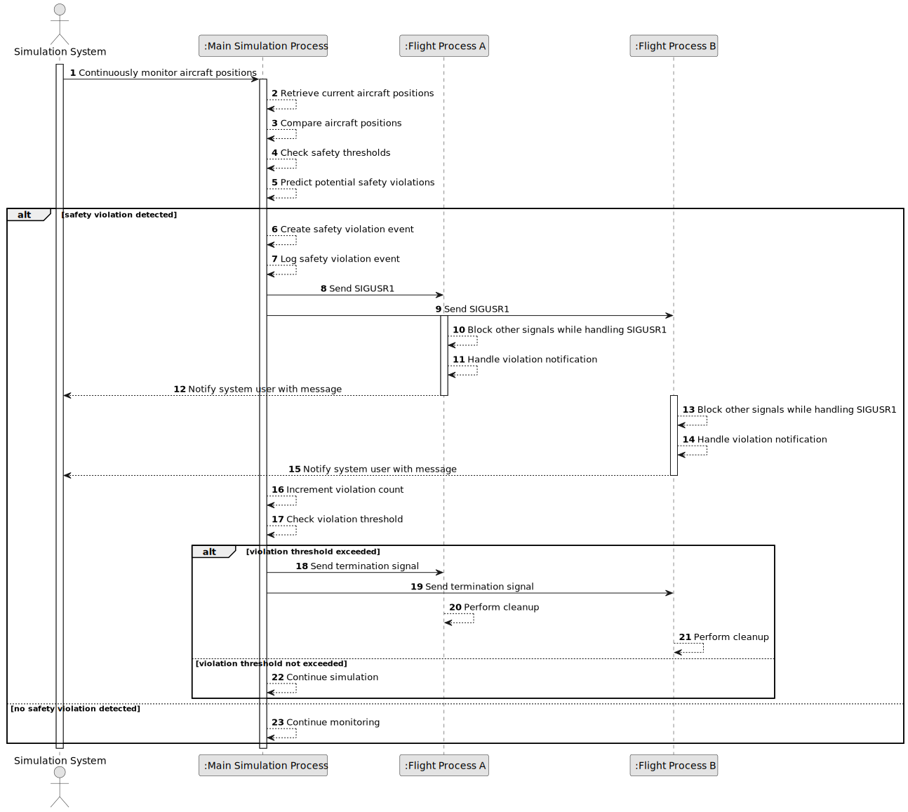

# US102 - Detect Aircraft Safety Violations in Real Time

## 1. Requirements Engineering

### 1.1. User Story Description

As a simulation system, I want to continuously monitor aircraft positions for overlaps so that I can identify and report safety violations.

This functionality allows the simulation system to continuously monitor current and past aircraft positions during a running simulation. The system must detect when two or more aircraft may eventually violate safety rules, such as being too close to each other.

When a safety violation is detected, the system must log the event and notify the involved flight processes through signals. Each involved flight process must handle the received signal and notify the system user with a message.

If the number of safety violations exceeds a predefined threshold, the system should allow early termination of the simulation by sending termination signals to the aircraft flight processes.

---

### 1.2. Customer Specifications and Clarifications

**From the specifications document:**

* The simulation system must continuously monitor aircraft positions for overlaps.
* The system must identify and report safety violations.
* The system must detect when two or more aircraft may eventually violate safety rules.
* Upon detecting a violation, the system should log the event.
* Upon detecting a violation, the system should notify the involved aircraft via signals.
* Each flight process must handle the received signal and notify the system user with a message.
* When a flight process receives a `SIGUSR1` signal, meaning violation detected, it should block other signals while handling it.
* The system should allow early termination if safety violations exceed a predefined threshold.
* Early termination should be performed by sending termination signals to aircraft.
* Flight processes must properly handle termination signals and perform any necessary cleanup.

**From the client clarifications:**

No additional client clarifications are currently available.

---

### 1.3. Acceptance Criteria

* **AC1:** The system must continuously monitor aircraft positions during simulation.
* **AC2:** The system must compare aircraft positions to detect possible overlaps or unsafe proximity.
* **AC3:** The system must detect when two or more aircraft may eventually violate safety rules.
* **AC4:** Safety violation detection must use the current aircraft positions.
* **AC5:** Safety violation detection may use past positions to anticipate future violations.
* **AC6:** When a safety violation is detected, the system must create a safety violation event.
* **AC7:** The safety violation event must identify the involved aircraft.
* **AC8:** The safety violation event must include the simulation timestamp or time step.
* **AC9:** The safety violation event must include the involved aircraft positions.
* **AC10:** The safety violation event must be logged.
* **AC11:** The system must notify the involved flight processes via signals.
* **AC12:** The signal used for violation detection notification must be `SIGUSR1`.
* **AC13:** Each involved flight process must handle `SIGUSR1`.
* **AC14:** Each involved flight process must notify the system user with a message after receiving `SIGUSR1`.
* **AC15:** While handling `SIGUSR1`, a flight process must block other signals.
* **AC16:** The system must maintain a count of safety violations.
* **AC17:** The system must compare the number of safety violations with a predefined threshold.
* **AC18:** If safety violations exceed the predefined threshold, the system should allow early termination.
* **AC19:** Early termination must be performed by sending termination signals to the aircraft flight processes.
* **AC20:** Flight processes must handle termination signals properly.
* **AC21:** Flight processes must perform necessary cleanup before termination.
* **AC22:** The system must not crash if a signal cannot be delivered to a flight process.
* **AC23:** Safety violation detection must be implemented as part of the C simulation component.

---

### 1.4. Found out Dependencies

* This user story depends on US100, because a running simulation with flight processes must exist.
* This user story depends on US101, because the system must receive and store aircraft positions before detecting violations.
* This user story is related to US103, because detection should later align with synchronized simulation time steps.
* This user story is related to US105, because later simulation architecture uses shared memory for inter-process communication.
* This user story is related to US106, because later architecture introduces a dedicated safety violation detection thread.
* This user story is related to US107, because later the report generation thread is notified when a safety violation occurs.
* This user story is related to US109 and US111, because safety violation events must appear in simulation reports.
* This user story is related to US113 and US114, because violations may later be logged and visualized remotely.

---

### 1.5. Input and Output Data

**Input Data:**

* Current aircraft positions:
    * Aircraft identifier
    * Timestamp or simulation time step
    * Latitude
    * Longitude
    * Altitude

* Past aircraft positions:
    * Position history per aircraft

* Safety thresholds:
    * Minimum horizontal separation
    * Minimum vertical separation
    * Maximum number of violations allowed before early termination

* Flight process information:
    * Aircraft identifier
    * Flight process ID
    * Signal handling status

**Output Data:**

* In case of detected violation:
    * Safety violation event
    * Log entry
    * Signal sent to involved flight processes
    * User notification message from each involved flight process

* In case of threshold exceeded:
    * Early termination decision
    * Termination signals sent to flight processes
    * Cleanup performed by flight processes

* In case of no violation:
    * No safety violation event is created

---

### 1.6. System Sequence Diagram

**_Other alternatives might exist._**

---

### 1.7. Other Relevant Remarks

* This user story focuses on real-time violation detection and signal notification.
* This user story does not define time-step synchronization; that belongs to US103.
* In the later hybrid architecture, this logic may move to a dedicated safety detection thread.
* `SIGUSR1` should be reserved for safety violation notification.
* Termination signals should be handled separately from `SIGUSR1`.
* Signal handlers must be carefully implemented to avoid unsafe operations inside handlers.