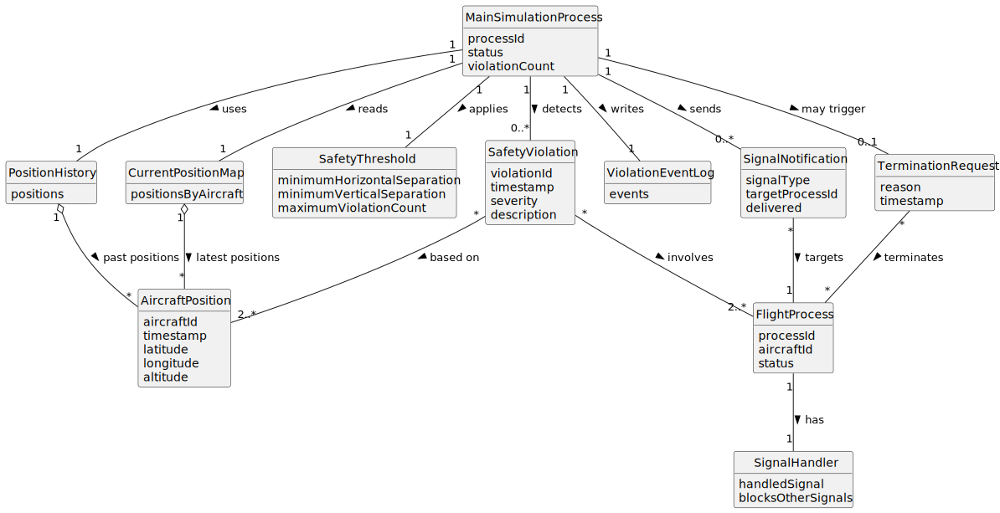

# US102 - Detect Aircraft Safety Violations in Real Time

## 2. Analysis

### 2.1. Relevant Domain Concepts

The relevant domain concepts for this user story are:

* **Main Simulation Process:** process responsible for monitoring aircraft positions and detecting violations.
* **Flight Process:** child process executing an aircraft's flight plan.
* **Aircraft Position:** current or historical aircraft location during simulation.
* **Position History:** stored past positions used to anticipate future violations.
* **Safety Threshold:** predefined minimum separation or violation limit.
* **Safety Violation:** event representing unsafe proximity or predicted unsafe proximity between aircraft.
* **Violation Event Log:** record of detected safety violations.
* **Signal Notification:** communication mechanism used to notify flight processes of violations.
* **SIGUSR1:** signal used to notify a flight process that a safety violation was detected.
* **Termination Signal:** signal used to terminate flight processes if the violation threshold is exceeded.
* **Signal Handler:** function executed by a flight process when receiving a signal.
* **Cleanup:** actions performed by a flight process before terminating.

---

### 2.2. Business Rules

* The simulation system must continuously monitor aircraft positions.
* The system must detect possible overlaps or unsafe proximity between aircraft.
* The system must detect when two or more aircraft may eventually violate safety rules.
* Safety detection must use current aircraft positions.
* Safety detection may use past positions to anticipate future violations.
* Every detected safety violation must be logged.
* Every detected safety violation must identify the involved aircraft.
* Involved flight processes must be notified via signals.
* `SIGUSR1` must be used to notify flight processes of a detected safety violation.
* A flight process must block other signals while handling `SIGUSR1`.
* A flight process must notify the system user when it handles a violation signal.
* The system must maintain a count of safety violations.
* If the number of violations exceeds the predefined threshold, the system should allow early termination.
* Early termination must be performed by sending termination signals to involved or all relevant aircraft flight processes.
* Flight processes must perform necessary cleanup when handling termination signals.
* Signal delivery failures must be handled safely.

---

### 2.3. Preconditions

* A simulation must be running.
* The main simulation process must be active.
* Flight processes must be active.
* Current aircraft positions must be available.
* Safety thresholds must be defined.
* Flight process IDs must be known to the main process.
* Signal handlers must be configured in flight processes.

---

### 2.4. Postconditions

**No violation detected:**

* No safety violation event is created.
* The simulation continues monitoring aircraft positions.

**Safety violation detected:**

* A safety violation event is created.
* The event is logged.
* The violation count is updated.
* Involved flight processes receive `SIGUSR1`.
* Involved flight processes notify the system user with a message.
* The simulation continues unless the violation threshold is exceeded.

**Violation threshold exceeded:**

* Early termination is triggered or allowed.
* Termination signals are sent to relevant flight processes.
* Flight processes handle termination signals.
* Flight processes perform cleanup.
* The simulation is safely stopped or marked for termination.

**Signal failure:**

* The failure is logged.
* The simulation handles the failure safely without crashing unexpectedly.

---

### 2.5. Domain Model

