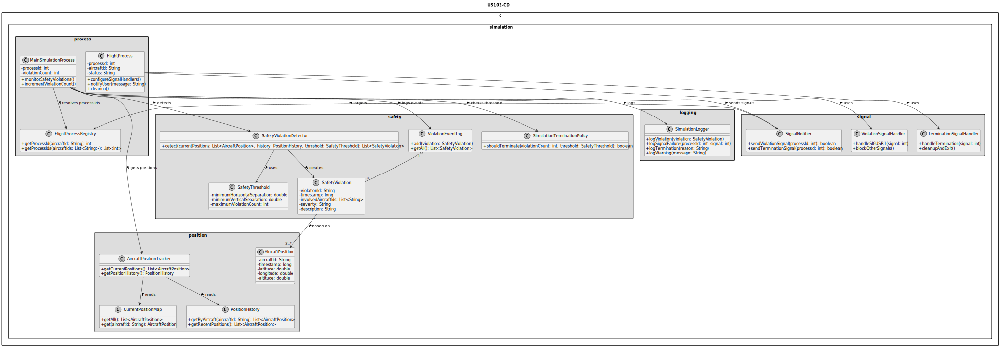
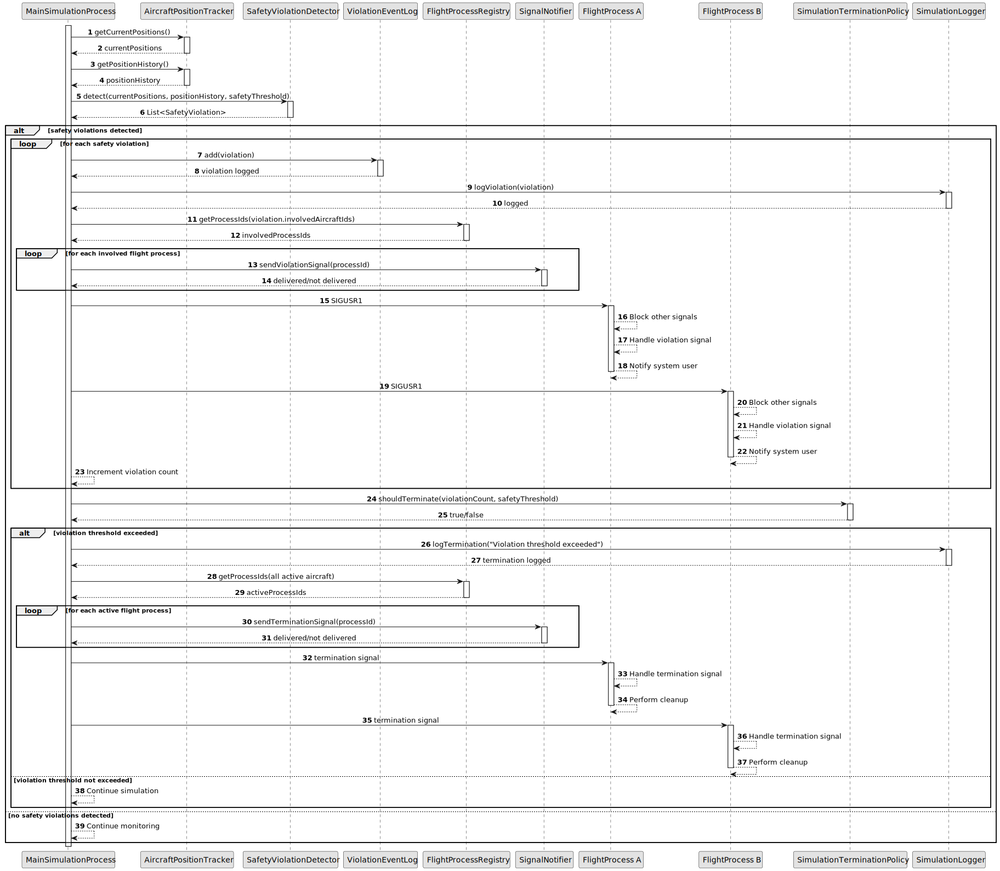

# US102 - Detect Aircraft Safety Violations in Real Time

## 3. Design

### 3.1. Responsibility Assignment

The safety violation detection process is divided between the following components:

* **MainSimulationProcess:** coordinates safety monitoring during simulation.
* **AircraftPositionTracker:** provides current aircraft positions and position history.
* **SafetyViolationDetector:** compares aircraft positions and detects unsafe proximity or predicted violations.
* **SafetyThreshold:** defines minimum separation and maximum violation count.
* **SafetyViolation:** represents a detected violation.
* **ViolationEventLog:** stores detected violation events.
* **SignalNotifier:** sends signals to involved flight processes.
* **FlightProcessRegistry:** maps aircraft identifiers to flight process IDs.
* **FlightProcess:** handles received signals.
* **ViolationSignalHandler:** handles `SIGUSR1` in each flight process.
* **TerminationSignalHandler:** handles termination signals in each flight process.
* **SimulationTerminationPolicy:** decides whether the violation count exceeds the allowed threshold.
* **SimulationLogger:** logs violations, signal delivery failures and termination events.

---

### 3.2. Class Diagram

---

### 3.3. Sequence Diagram

---

### 3.4. Applied Patterns

* **Monitor:** continuously checks aircraft positions during simulation.
* **Detector:** isolates safety violation detection rules.
* **Event Log:** stores detected violation events.
* **Signal Notification:** notifies involved flight processes through OS signals.
* **Registry:** maps aircraft to process IDs.
* **Policy:** decides whether early termination should occur.
* **Defensive Signal Handling:** handles signal delivery and process termination safely.

---

### 3.5. Design Remarks

* The detector should not directly send signals; it should return detected violations.
* Signal sending should be isolated in `SignalNotifier`.
* `SIGUSR1` should be reserved for violation detected notifications.
* Flight processes should configure their `SIGUSR1` handler during initialization.
* While handling `SIGUSR1`, other signals should be blocked.
* Termination signal handling should perform cleanup before process exit.
* The violation count should be maintained by the main process or simulation state.