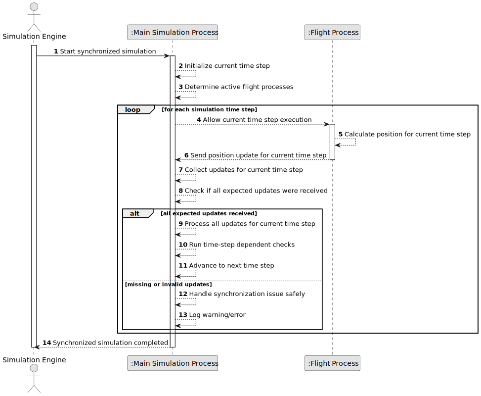

# US103 - Synchronize Flight Execution with a Time Step

## 1. Requirements Engineering

### 1.1. User Story Description

As a simulation engine, I want to synchronize aircraft movements based on time steps so that I can accurately simulate real-world execution.

This functionality ensures that the simulation progresses step by step. Each flight process must produce and send position updates at defined intervals. The main process must collect and process all position updates for the current time step before allowing the simulation to advance to the next time step.

This synchronization prevents aircraft positions from being compared at inconsistent simulation times and provides a reliable foundation for movement processing, safety violation detection and report generation.

---

### 1.2. Customer Specifications and Clarifications

**From the specifications document:**

* The simulation must progress step by step.
* Each flight process should send position updates at defined intervals.
* The main process must ensure all updates for a given time step are processed before advancing to the next step.
* The simulation component is implemented in C.
* Flight processes communicate with the main process during simulation.

**From the client clarifications:**

No additional client clarifications are currently available.

---

### 1.3. Acceptance Criteria

* **AC1:** The simulation must progress step by step.
* **AC2:** The simulation must have a defined time step interval.
* **AC3:** Each flight process must execute its movement calculation for the current time step.
* **AC4:** Each flight process must send a position update at the defined interval.
* **AC5:** Each position update must identify the corresponding time step.
* **AC6:** The main process must collect position updates for the current time step.
* **AC7:** The main process must process all received updates for the current time step.
* **AC8:** The main process must not advance to the next time step before all expected updates for the current step are processed.
* **AC9:** If a flight process finishes its flight, it should no longer block future time steps.
* **AC10:** If a flight process fails to provide an update, the main process must handle the situation safely.
* **AC11:** Position updates from a future time step must not be processed before the current time step is complete.
* **AC12:** Safety violation detection should run only after all relevant position updates for a time step have been processed.
* **AC13:** The synchronization mechanism must be implemented as part of the C simulation component.
* **AC14:** Synchronization errors must be logged or reported meaningfully.

---

### 1.4. Found out Dependencies

* This user story depends on US100, because the simulation and flight processes must exist.
* This user story depends on US101, because flight processes send movement/position updates.
* This user story is related to US102, because safety violation detection should operate on complete position data for a time step.
* This user story is related to US108, because US108 later enforces step-by-step progression using semaphores.
* This user story is related to US109 and US111, because reports may depend on consistent time-step data.
* This user story is related to US113 and US114, because remote logging and visualization depend on step-by-step progress updates.

---

### 1.5. Input and Output Data

**Input Data:**

* Simulation time configuration:
    * Start time
    * End time
    * Time step interval

* Flight process data:
    * Flight process identifier
    * Aircraft identifier
    * Flight status
    * Position update for the current time step

**Output Data:**

* In case of successful time step processing:
    * All current time step updates processed
    * Current simulation time advanced to next step

* In case of synchronization issue:
    * Error or warning log
    * Safe handling of missing, delayed or invalid update

---

### 1.6. System Sequence Diagram

**_Other alternatives might exist._**

---

### 1.7. Other Relevant Remarks

* This user story defines the conceptual time-step synchronization.
* US108 later refines this with semaphores.
* A completed or terminated flight process should be excluded from the list of expected updates.
* The main process should use complete time-step data when checking for safety violations.