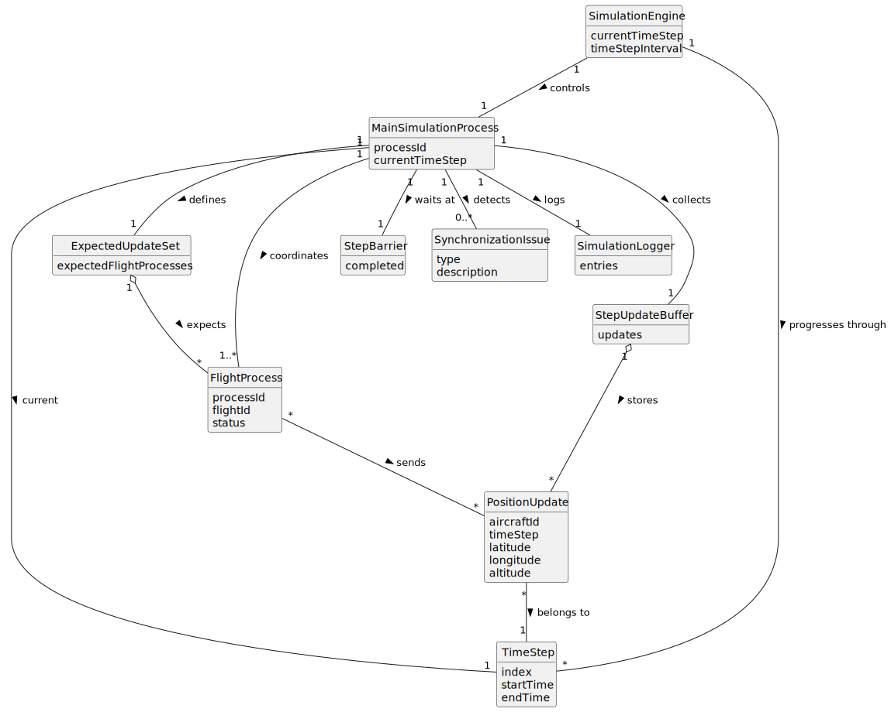

# US103 - Synchronize Flight Execution with a Time Step

## 2. Analysis

### 2.1. Relevant Domain Concepts

The relevant domain concepts for this user story are:

* **Simulation Engine:** component responsible for controlling simulation progression.
* **Main Simulation Process:** parent process coordinating the simulation.
* **Flight Process:** child process executing an aircraft's flight plan.
* **Time Step:** discrete simulation interval used to advance all flights consistently.
* **Position Update:** aircraft position sent by a flight process for a given time step.
* **Expected Update:** update that the main process expects from an active flight process.
* **Step Barrier:** synchronization point that prevents the simulation from advancing before required updates are processed.
* **Active Flight Process:** flight process that is still running and expected to send updates.
* **Completed Flight Process:** flight process that has finished and should no longer block simulation progress.
* **Synchronization Issue:** missing, delayed, invalid or out-of-order update.

---

### 2.2. Business Rules

* The simulation must progress in discrete time steps.
* The time step interval must be defined before simulation starts.
* Each active flight process must calculate its position for the current time step.
* Each active flight process must send one position update per time step.
* Each position update must indicate the time step it belongs to.
* The main process must collect updates for the current time step.
* The main process must process all expected updates before advancing.
* Future-step updates must not be processed as current-step data.
* Finished flight processes must be removed from the expected update set.
* Missing or invalid updates must be handled safely.
* Safety checks should run only after the current time step data is complete.
* Synchronization failures must be logged or reported.

---

### 2.3. Preconditions

* The simulation must be running.
* The main simulation process must be active.
* One or more flight processes may be active.
* The time step interval must be defined.
* Pipes or another communication mechanism must exist between flight processes and the main process.
* Flight processes must be capable of sending position updates with time step identification.

---

### 2.4. Postconditions

**Successful time step synchronization:**

* All expected position updates for the current time step are received.
* All valid updates are processed.
* Time-step dependent checks may be executed.
* The simulation advances to the next time step.

**Completed flight process:**

* The flight process is removed from the expected update set.
* Future time steps no longer wait for that process.

**Synchronization issue:**

* The issue is handled safely.
* The simulation does not advance using incomplete or inconsistent data unless a defined fallback rule allows it.
* The issue is logged or reported.

---

### 2.5. Domain Model

