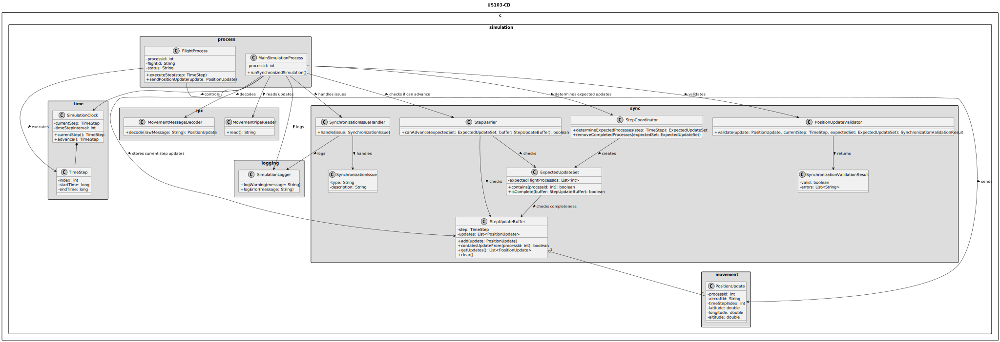
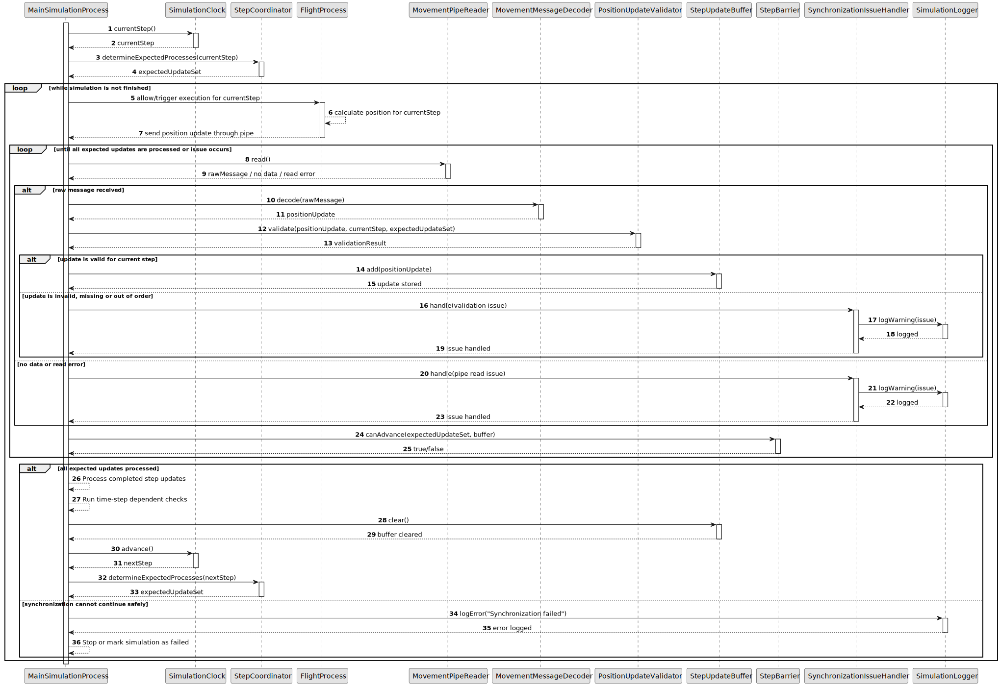

# US103 - Synchronize Flight Execution with a Time Step

## 3. Design

### 3.1. Responsibility Assignment

The time-step synchronization process is divided between the following components:

* **SimulationClock:** stores the current simulation time step and advances the simulation clock.
* **MainSimulationProcess:** coordinates flight processes and controls progression between time steps.
* **FlightProcess:** calculates and sends position updates for each time step.
* **TimeStep:** represents a discrete simulation interval.
* **StepCoordinator:** determines which flight processes are expected to send updates for the current step.
* **StepUpdateBuffer:** stores received position updates for the current time step.
* **StepBarrier:** checks whether all expected updates have been received.
* **MovementPipeReader:** reads position updates sent by flight processes.
* **PositionUpdateValidator:** validates whether updates belong to the current time step.
* **SynchronizationIssueHandler:** handles missing, invalid or out-of-order updates.
* **SimulationLogger:** logs synchronization warnings and errors.

---

### 3.2. Class Diagram

---

### 3.3. Sequence Diagram

---

### 3.4. Applied Patterns

* **Discrete-Time Simulation:** simulation advances in fixed time steps.
* **Barrier Synchronization:** main process waits until all expected updates for a step are processed.
* **Coordinator:** centralizes the logic for expected updates.
* **Buffer:** stores updates for the current step before processing.
* **Validator:** rejects updates that are missing, invalid or out of order.
* **Defensive Processing:** handles failed or completed flight processes safely.

---

### 3.5. Design Remarks

* The main process controls progression between time steps.
* Flight processes should not independently advance the global simulation time.
* Updates from completed flight processes should no longer be expected.
* Updates for future time steps should be buffered or rejected according to final implementation choice.
* US108 later implements stronger lockstep synchronization with semaphores.