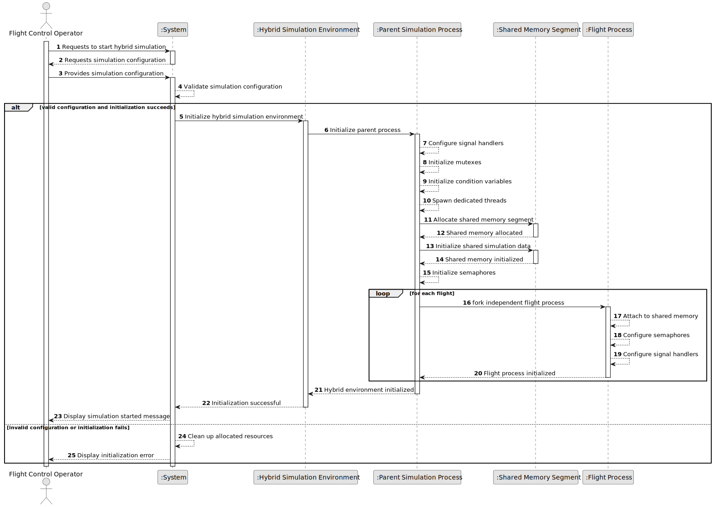

# US105 - Initialize Hybrid Simulation Environment with Shared Memory

## 1. Requirements Engineering

### 1.1. User Story Description

As a Flight Control Operator, I want to start the simulation with a multi-threaded parent process and multiple child flight processes communicating through a shared memory area, so that the system efficiently coordinates simulation data across processes.

This functionality initializes the hybrid simulation environment. The parent simulation process must create dedicated threads for its internal functionalities, launch each flight as an independent child process, allocate and initialize a shared memory segment, and configure synchronization mechanisms for safe inter-process and intra-process coordination.

The component must be implemented in C and must use threads, mutexes, condition variables, semaphores and signals.

---

### 1.2. Customer Specifications and Clarifications

**From the specifications document:**

* A Flight Control Operator can start the simulation with a multi-threaded parent process.
* The simulation uses multiple child flight processes.
* Parent process and child flight processes communicate through a shared memory area.
* The parent process spawns dedicated threads for its functionalities.
* Each flight is launched as an independent process.
* A shared memory segment is allocated and properly initialized for inter-process communication.
* Flight processes are configured to use semaphores for synchronization.
* This component must be implemented in C.
* This component must utilize threads, mutexes, condition variables and signals.

**From the client clarifications:**

No additional client clarifications are currently available.

---

### 1.3. Acceptance Criteria

* **AC1:** A Flight Control Operator must be able to start the hybrid simulation environment.
* **AC2:** The Flight Control Operator must be authenticated and authorized, if invoked through the application layer.
* **AC3:** The parent simulation process must be initialized.
* **AC4:** The parent process must spawn dedicated threads for its functionalities.
* **AC5:** Each flight must be launched as an independent child process.
* **AC6:** A shared memory segment must be allocated.
* **AC7:** The shared memory segment must be properly initialized before child flight processes use it.
* **AC8:** The shared memory segment must contain the data required for inter-process communication.
* **AC9:** Flight processes must be configured to access the shared memory segment.
* **AC10:** Flight processes must be configured to use semaphores for synchronization.
* **AC11:** Mutexes must be used to protect thread-shared parent process data.
* **AC12:** Condition variables must be available for coordination between parent process threads.
* **AC13:** Signals must be configured for process notification and termination handling.
* **AC14:** The system must handle shared memory allocation failure safely.
* **AC15:** The system must handle thread creation failure safely.
* **AC16:** The system must handle child process creation failure safely.
* **AC17:** The system must clean up shared memory, semaphores, mutexes and condition variables when initialization fails.
* **AC18:** The system must clean up allocated resources when the simulation ends.
* **AC19:** This component must be implemented in C.

---

### 1.4. Found out Dependencies

* This user story depends on US100, because it evolves the base simulation environment.
* This user story depends on US101, because movement/position data will be stored and coordinated through the simulation environment.
* This user story depends on US102, because safety violation detection will later scan shared simulation data.
* This user story depends on US103, because simulation time-step progression needs synchronization.
* This user story is related to US106, because the parent process must spawn dedicated function-specific threads.
* This user story is related to US107, because condition variables are used for thread notification after safety violations.
* This user story is related to US108, because semaphores enforce step-by-step simulation synchronization.
* This user story is related to US109, US110 and US111, because report generation and environmental influences depend on shared simulation data.

---

### 1.5. Input and Output Data

**Input Data:**

* Simulation configuration:
    * Number of flights
    * Flight identifiers
    * Time-step configuration
    * Shared memory size or capacity
    * Safety thresholds
    * Performance settings

**Output Data:**

* In case of success:
    * Initialized parent process
    * Created parent process threads
    * Created child flight processes
    * Allocated and initialized shared memory segment
    * Configured semaphores
    * Configured mutexes and condition variables
    * Configured signal handlers

* In case of failure:
    * Error message or log entry explaining the initialization failure
    * Cleaned-up resources

---

### 1.6. System Sequence Diagram

**_Other alternatives might exist._**

---

### 1.7. Other Relevant Remarks

* This user story establishes the hybrid simulation architecture.
* It does not define the detailed responsibilities of every dedicated thread; those are refined in US106.
* It does not define the complete semaphore-based step synchronization; that is refined in US108.
* Shared memory must be initialized before child processes attempt to read or write to it.
* Resource cleanup is essential because this US uses OS-level resources.