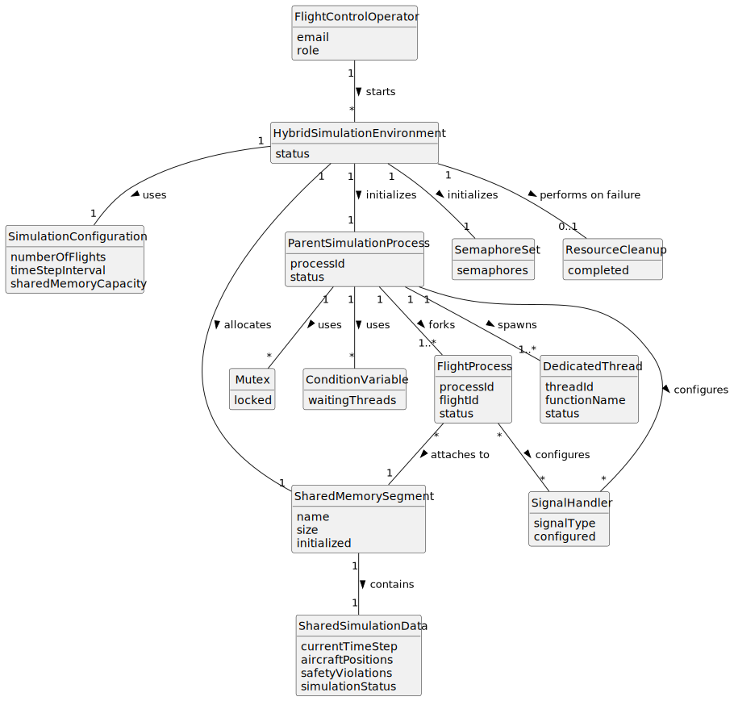

# US105 - Initialize Hybrid Simulation Environment with Shared Memory

## 2. Analysis

### 2.1. Relevant Domain Concepts

The relevant domain concepts for this user story are:

* **Flight Control Operator:** user who starts the simulation.
* **Hybrid Simulation Environment:** simulation architecture combining a multi-threaded parent process, child flight processes and shared memory.
* **Parent Simulation Process:** main process responsible for coordinating the simulation.
* **Dedicated Thread:** thread created by the parent process to execute a specific functionality.
* **Flight Process:** independent child process responsible for executing a flight.
* **Shared Memory Segment:** memory area used for inter-process communication between the parent process and flight processes.
* **Semaphore:** synchronization mechanism used between processes.
* **Mutex:** synchronization mechanism used between threads inside the parent process.
* **Condition Variable:** mechanism used for thread coordination inside the parent process.
* **Signal Handler:** mechanism used to handle process notifications and termination.
* **Simulation Configuration:** data required to initialize the simulation environment.
* **Resource Cleanup:** release of OS-level resources when initialization fails or the simulation ends.

---

### 2.2. Business Rules

* The hybrid simulation environment must be initialized before simulation execution.
* The parent process must be initialized before child flight processes are launched.
* The parent process must spawn dedicated threads for its functionalities.
* Each flight must be launched as an independent process.
* Shared memory must be allocated before child processes access it.
* Shared memory must be initialized before child processes access it.
* Flight processes must attach to the shared memory segment.
* Flight processes must use semaphores for synchronization.
* Parent process threads must use mutexes and condition variables where needed.
* Signal handlers must be configured for process notification and cleanup.
* If any initialization step fails, allocated resources must be cleaned up.
* The component must be implemented in C.

---

### 2.3. Preconditions

* The simulation configuration must be available.
* The number of flights must be known.
* Required simulation parameters must be valid.
* The operating system must support the required mechanisms:
    * processes;
    * shared memory;
    * semaphores;
    * threads;
    * mutexes;
    * condition variables;
    * signals.

---

### 2.4. Postconditions

**Successful initialization:**

* The parent simulation process is initialized.
* Dedicated parent threads are created.
* Shared memory is allocated and initialized.
* Semaphores are initialized.
* Mutexes and condition variables are initialized.
* Each flight is launched as an independent child process.
* Each flight process is attached to shared memory.
* Signal handlers are configured.
* The hybrid simulation environment is ready to execute.

**Failed initialization:**

* The hybrid simulation environment is not started.
* Any partially allocated shared memory is released.
* Any initialized semaphores, mutexes or condition variables are destroyed.
* Any created child processes or threads are safely handled.
* An error is logged or reported.

---

### 2.5. Domain Model

