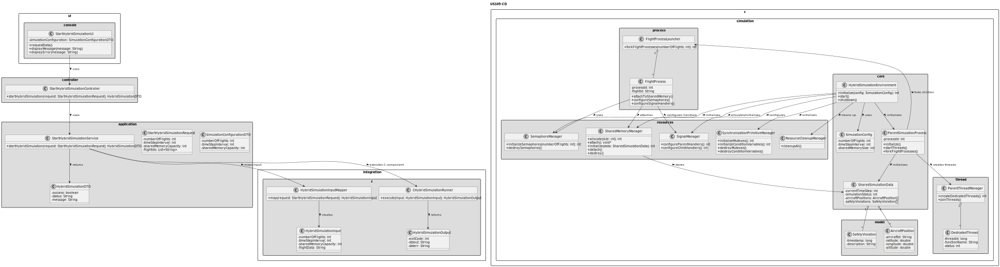
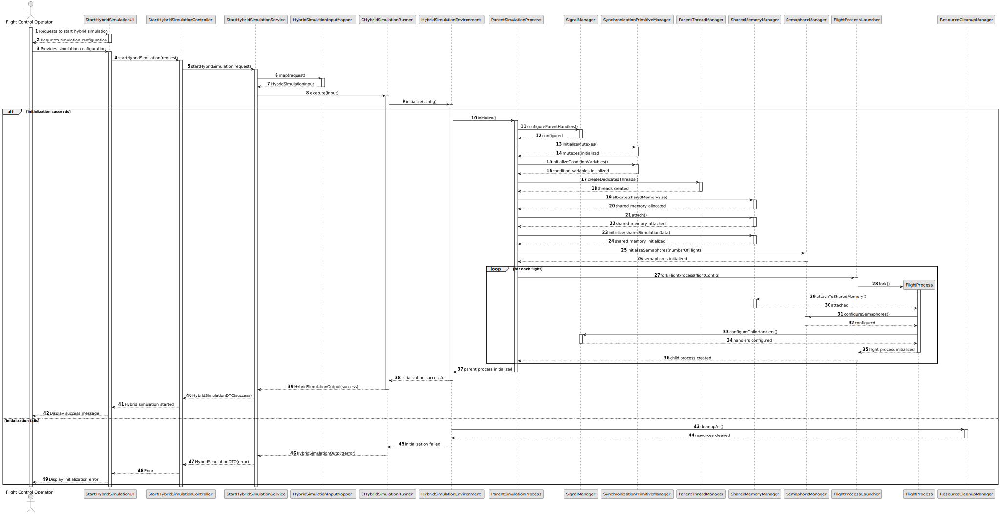

# US105 - Initialize Hybrid Simulation Environment with Shared Memory

## 3. Design

### 3.1. Responsibility Assignment

The hybrid simulation initialization process is divided between the following components:

* **StartHybridSimulationUI:** interacts with the Flight Control Operator and collects simulation configuration.
* **StartHybridSimulationController:** receives the simulation start request.
* **StartHybridSimulationService:** validates the request and invokes the C hybrid simulation runner.
* **HybridSimulationInputMapper:** maps application data into the input expected by the C component.
* **CHybridSimulationRunner:** executes the C hybrid simulation component.
* **HybridSimulationEnvironment:** coordinates initialization of all C simulation resources.
* **ParentSimulationProcess:** initializes parent process state and coordinates child processes and threads.
* **ParentThreadManager:** creates dedicated parent process threads.
* **SharedMemoryManager:** allocates, attaches, initializes and destroys shared memory.
* **SharedSimulationData:** structure stored in the shared memory segment.
* **SemaphoreManager:** initializes semaphores used by flight processes.
* **SynchronizationPrimitiveManager:** initializes mutexes and condition variables.
* **FlightProcessLauncher:** forks independent child flight processes.
* **SignalManager:** configures signal handlers for parent and child processes.
* **ResourceCleanupManager:** releases resources if initialization fails or simulation ends.

---

### 3.2. Class Diagram

---

### 3.3. Sequence Diagram

---

### 3.4. Applied Patterns

* **Hybrid Process/Thread Architecture:** combines parent process threads with child flight processes.
* **Shared Memory IPC:** uses shared memory for inter-process communication.
* **Semaphore Synchronization:** prepares flight processes for synchronized execution.
* **Mutex/Condition Variable Synchronization:** coordinates parent process threads.
* **Resource Manager:** isolates OS-level resource lifecycle.
* **Adapter:** isolates Java/application layer from the C component.
* **Fail-fast Initialization:** stops initialization and cleans up resources when a required step fails.

---

### 3.5. Design Remarks

* Shared memory must be allocated before flight processes are forked.
* Shared simulation data must be initialized before children attach/use it.
* Semaphores must be initialized before flight processes begin synchronization.
* Mutexes and condition variables are mainly for parent process thread coordination.
* Signal handlers should be configured early.
* Every OS-level resource needs a cleanup path.
* This user story prepares the architecture used by US106, US107 and US108.