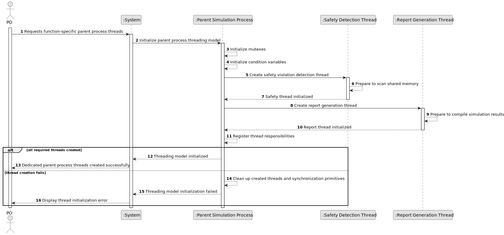

# US106 - Implement Function-Specific Threads in the Parent Process

## 1. Requirements Engineering

### 1.1. User Story Description

As a PO, I want the simulation controller parent process to have at least two dedicated threads, one for safety violation detection and one for report generation, so that each functionality operates concurrently and independently.

This functionality defines the internal threaded architecture of the parent simulation process. The parent process must create dedicated threads for specific simulation responsibilities instead of executing all parent-side logic sequentially in a single control flow.

At minimum, the parent process must create:

* a safety violation detection thread, responsible for scanning shared memory for aircraft flight conflicts;
* a report generation thread, responsible for compiling simulation results and responding to safety violation events.

Additional threads may be created for other required simulation functionalities, such as environment updates, logging or step coordination. Threads must be managed using mutexes and condition variables for internal synchronization.

---

### 1.2. Customer Specifications and Clarifications

**From the specifications document:**

* The simulation controller parent process must have at least two dedicated threads.
* One thread must be responsible for safety violation detection.
* One thread must be responsible for report generation.
* The safety violation detection thread is responsible for scanning shared memory for aircraft flight conflicts.
* The report generation thread is responsible for compiling simulation results and responding to safety violation events.
* Additional threads may be created for other required functionalities.
* Threads must be managed using mutexes and condition variables for internal synchronization.

**From the client clarifications:**

No additional client clarifications are currently available.

---

### 1.3. Acceptance Criteria

* **AC1:** The parent simulation process must create at least two dedicated threads.
* **AC2:** The parent process must create a safety violation detection thread.
* **AC3:** The safety violation detection thread must scan shared memory for aircraft flight conflicts.
* **AC4:** The parent process must create a report generation thread.
* **AC5:** The report generation thread must compile simulation results.
* **AC6:** The report generation thread must respond to safety violation events.
* **AC7:** The parent process may create additional threads for other required functionalities.
* **AC8:** Each dedicated thread must have a clear responsibility.
* **AC9:** Threads must be managed using mutexes when accessing shared parent process data.
* **AC10:** Threads must use condition variables when waiting for or notifying relevant events.
* **AC11:** The parent process must initialize required mutexes before starting the threads.
* **AC12:** The parent process must initialize required condition variables before starting the threads.
* **AC13:** The parent process must handle thread creation failure safely.
* **AC14:** The parent process must coordinate thread termination when the simulation ends.
* **AC15:** Mutexes and condition variables must be destroyed during cleanup.
* **AC16:** This functionality must be implemented in C.

---

### 1.4. Found out Dependencies

* This user story depends on US105, because the hybrid simulation environment and parent process must exist before dedicated threads can be created.
* This user story depends on US101, because movement and position data are stored and later scanned by the safety violation detection thread.
* This user story depends on US102, because one dedicated thread performs safety violation detection.
* This user story is related to US107, because the safety violation detection thread will notify the report generation thread through condition variables.
* This user story is related to US108, because parent process threads must later advance in lockstep with the simulation time step.
* This user story is related to US109 and US111, because report generation responsibilities are handled by the report generation thread.
* This user story is related to US110, because an additional environment thread may be created for environmental influences.

---

### 1.5. Input and Output Data

**Input Data:**

* Parent process initialization state
* Shared memory reference
* Simulation configuration
* Thread configuration, if defined
* Mutex and condition variable configuration

**Output Data:**

* In case of success:
    * Created safety violation detection thread
    * Created report generation thread
    * Optional additional threads
    * Initialized mutexes
    * Initialized condition variables
    * Thread management status

* In case of failure:
    * Error message or log entry explaining the thread initialization failure
    * Cleaned-up partially initialized thread resources

---

### 1.6. System Sequence Diagram

**_Other alternatives might exist._**

---

### 1.7. Other Relevant Remarks

* This user story focuses on the parent process internal threading model.
* The detailed condition-variable notification between the safety thread and report thread is refined in US107.
* The detailed report content is refined in US109 and US111.
* The environment thread is refined in US110.
* Thread responsibilities should remain separated to avoid large, hard-to-maintain parent process logic.