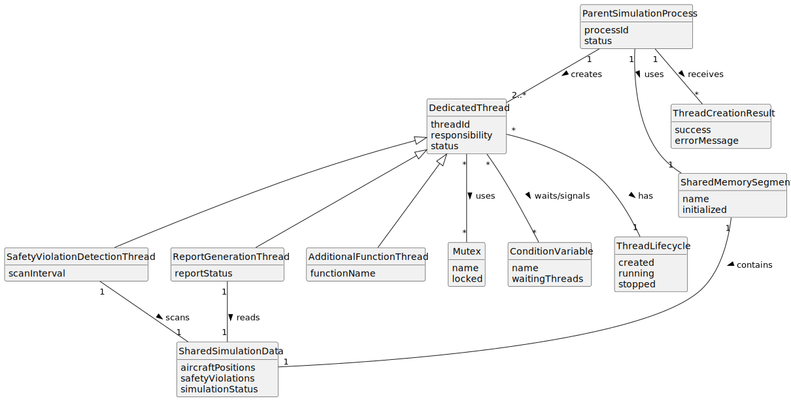

# US106 - Implement Function-Specific Threads in the Parent Process

## 2. Analysis

### 2.1. Relevant Domain Concepts

The relevant domain concepts for this user story are:

* **Parent Simulation Process:** main simulation process responsible for coordinating the hybrid simulation.
* **Dedicated Thread:** thread created for one specific parent-side functionality.
* **Safety Violation Detection Thread:** thread that scans shared memory for aircraft flight conflicts.
* **Report Generation Thread:** thread that compiles simulation results and responds to safety violation events.
* **Additional Function-Specific Thread:** optional thread created for another required functionality.
* **Shared Memory:** memory segment containing simulation data used by parent process threads and flight processes.
* **Mutex:** synchronization primitive used to protect shared parent process data.
* **Condition Variable:** synchronization primitive used to notify or wake threads when relevant events occur.
* **Thread Lifecycle:** creation, execution, waiting, termination and cleanup of a thread.
* **Thread Responsibility:** functional purpose assigned to a dedicated thread.

---

### 2.2. Business Rules

* The parent simulation process must create at least two dedicated threads.
* One dedicated thread must be responsible for safety violation detection.
* One dedicated thread must be responsible for report generation.
* The safety violation detection thread must scan shared memory for aircraft flight conflicts.
* The report generation thread must compile simulation results.
* The report generation thread must respond to safety violation events.
* Additional threads may be created for other required functionalities.
* Each thread should have one clear responsibility.
* Access to shared parent process data must be protected with mutexes.
* Condition variables must be used when threads need to wait for or respond to events.
* Thread creation failures must be handled safely.
* Threads must be terminated and cleaned up safely when the simulation ends.

---

### 2.3. Preconditions

* The hybrid simulation environment must be initialized.
* The parent simulation process must exist.
* Shared memory must be allocated and initialized.
* Required mutexes must be initialized before shared data is accessed.
* Required condition variables must be initialized before threads wait or signal events.

---

### 2.4. Postconditions

**Successful thread initialization:**

* The safety violation detection thread is created.
* The report generation thread is created.
* Optional additional function-specific threads may be created.
* Mutexes and condition variables are available for synchronization.
* The parent process can execute multiple functionalities concurrently.

**Failed thread initialization:**

* The failure is logged or reported.
* Partially created threads are handled safely.
* Initialized synchronization primitives are destroyed if needed.
* The parent process does not continue with an inconsistent threading model.

---

### 2.5. Domain Model

