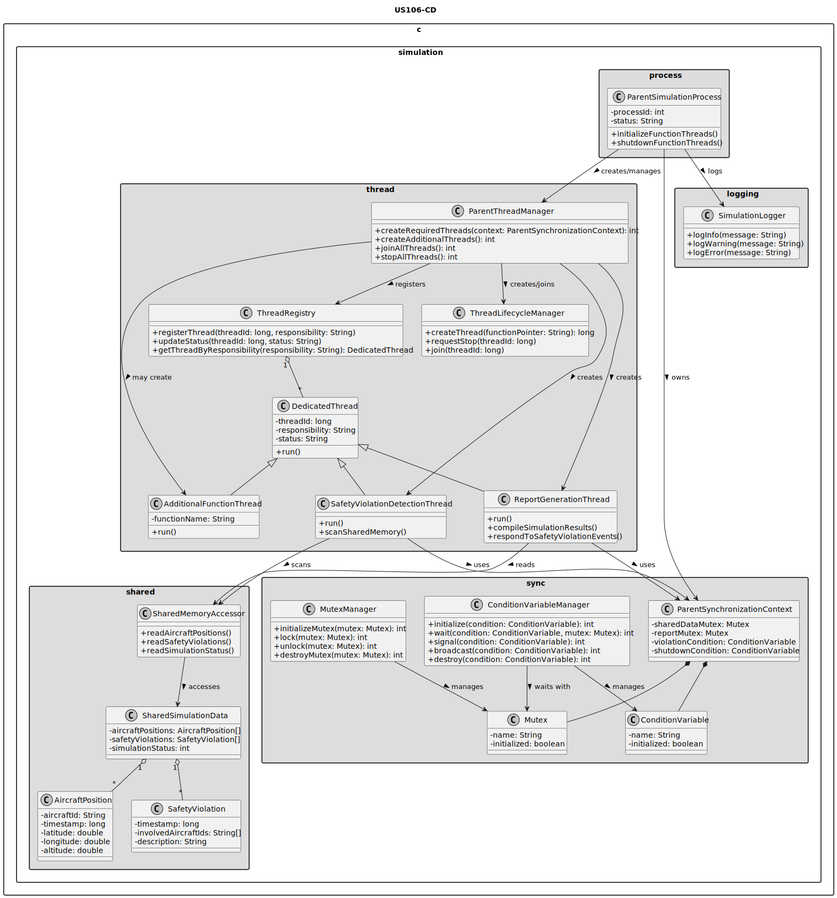
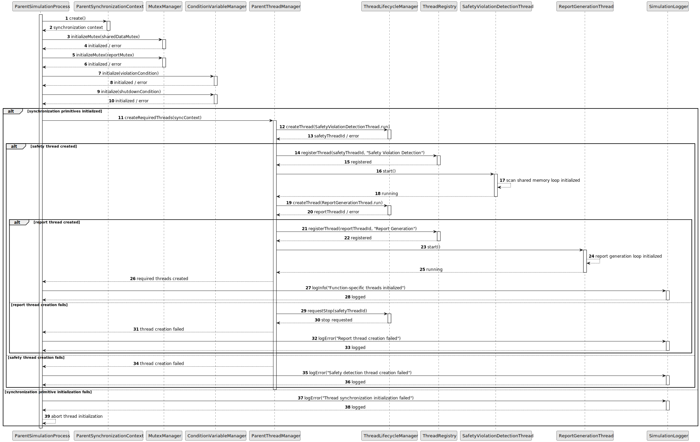

# US106 - Implement Function-Specific Threads in the Parent Process

## 3. Design

### 3.1. Responsibility Assignment

The function-specific threading process is divided between the following components:

* **ParentSimulationProcess:** owns and manages parent-side simulation responsibilities.
* **ParentThreadManager:** creates, registers, monitors and joins dedicated parent process threads.
* **ThreadRegistry:** stores metadata about created threads and their responsibilities.
* **SafetyViolationDetectionThread:** scans shared memory for aircraft flight conflicts.
* **ReportGenerationThread:** compiles simulation results and responds to safety violation events.
* **AdditionalFunctionThread:** represents optional extra threads for other simulation functions.
* **SharedMemoryAccessor:** provides controlled access to shared simulation data.
* **ParentSynchronizationContext:** owns mutexes and condition variables used by parent threads.
* **MutexManager:** initializes, locks, unlocks and destroys mutexes.
* **ConditionVariableManager:** initializes, waits, signals, broadcasts and destroys condition variables.
* **ThreadLifecycleManager:** handles thread creation, shutdown and cleanup.
* **SimulationLogger:** logs thread creation, synchronization and shutdown events.

---

### 3.2. Class Diagram

---

### 3.3. Sequence Diagram

---

### 3.4. Applied Patterns

* **Function-Specific Threading:** separates parent process responsibilities into dedicated threads.
* **Thread Registry:** records thread identifiers, responsibilities and status.
* **Synchronization Context:** centralizes mutexes and condition variables.
* **Mutex-protected Access:** protects shared data from concurrent access issues.
* **Condition-variable Coordination:** allows threads to wait for and react to events.
* **Lifecycle Management:** creates, monitors and terminates threads safely.

---

### 3.5. Design Remarks

* Thread creation should happen after shared memory and synchronization primitives are initialized.
* The safety detection thread should not directly generate the final report.
* The report generation thread should not directly scan for aircraft conflicts.
* US107 will refine the notification mechanism between safety detection and report generation.
* Thread shutdown must be coordinated to avoid orphaned or blocked threads.
* All mutexes and condition variables should have a clear owner and cleanup path.