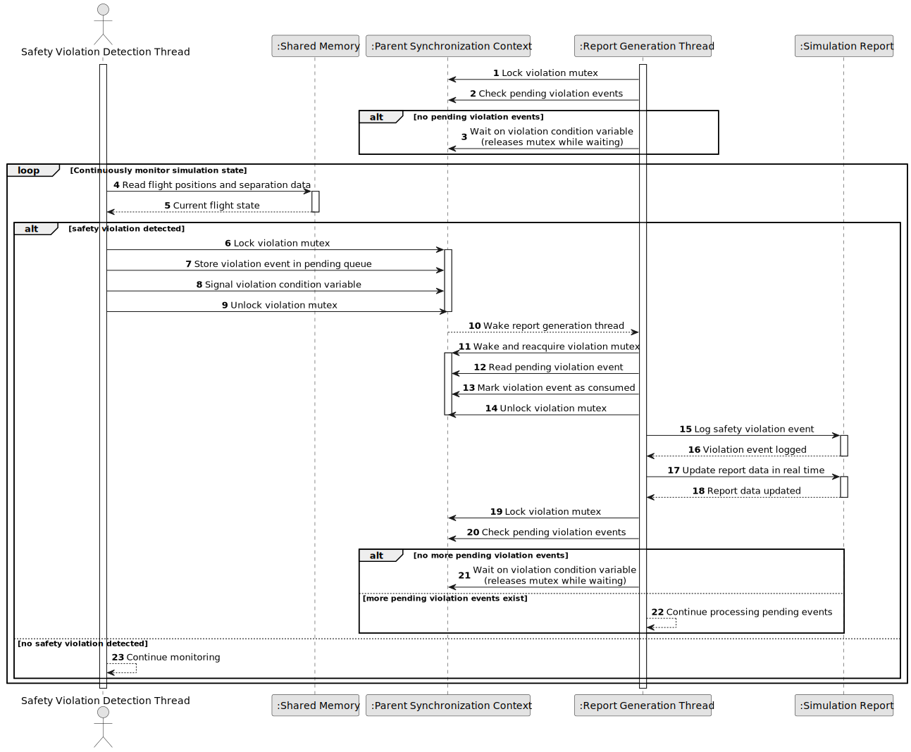

# US107 - Notify Report Thread on Safety Violation

## 1. Requirements Engineering

### 1.1. User Story Description

As a Safety Violation Detection Thread, I want to notify the Report Generation Thread when a safety violation occurs, so that the report can include updated violation information.

This functionality allows the safety violation detection thread to notify the report generation thread whenever a safety violation is detected. The notification must be implemented using a condition variable. Shared violation data must be protected by a mutex to avoid inconsistent reads or writes between threads.

The report generation thread should wait for safety violation events and wake up when the condition variable is signalled. Once awakened, it should safely read the updated violation data and incorporate it into the simulation report data.

---

### 1.2. Customer Specifications and Clarifications

**From the specifications document:**

* The parent process must have a safety violation detection thread.
* The parent process must have a report generation thread.
* The report generation thread is responsible for compiling simulation results and responding to safety violation events.
* Threads must be managed using mutexes and condition variables for internal synchronization.
* Safety violation detection scans shared memory for aircraft flight conflicts.

**From the client clarifications:**

No additional client clarifications are currently available.

---

### 1.3. Acceptance Criteria

* **AC1:** The safety violation detection thread must detect safety violation events.
* **AC2:** When a safety violation is detected, the safety thread must update shared violation data.
* **AC3:** Shared violation data must be protected by a mutex.
* **AC4:** The safety thread must signal a condition variable after updating the violation data.
* **AC5:** The report generation thread must wait on the condition variable when there are no new violation events.
* **AC6:** The report generation thread must wake up when the condition variable is signalled.
* **AC7:** The report generation thread must read violation data under mutex protection.
* **AC8:** The report generation thread must include the violation event in the report data.
* **AC9:** The system must avoid lost notifications where possible.
* **AC10:** The system must handle multiple violation events safely.
* **AC11:** The system must avoid race conditions between the safety thread and the report thread.
* **AC12:** The condition variable and mutex must be initialized before the threads start.
* **AC13:** The condition variable and mutex must be destroyed during cleanup.
* **AC14:** If the report thread is shutting down, it must not remain blocked forever on the condition variable.
* **AC15:** This functionality must be implemented in C.

---

### 1.4. Found out Dependencies

* This user story depends on US105, because the hybrid simulation environment must initialize mutexes and condition variables.
* This user story depends on US106, because the safety violation detection thread and report generation thread must exist.
* This user story depends on US102, because safety violations must be detected before they can be reported.
* This user story is related to US108, because step-by-step simulation synchronization affects when violations are detected.
* This user story is related to US109 and US111, because the report generation thread uses violation events to build simulation reports.
* This user story is related to US113 and US114, because safety violation events may later be logged or visualized remotely.

---

### 1.5. Input and Output Data

**Input Data:**

* Safety violation event:
    * Violation identifier
    * Simulation timestamp or time step
    * Involved aircraft identifiers
    * Violation type
    * Severity
    * Description

* Synchronization objects:
    * Violation mutex
    * Violation condition variable
    * Shutdown flag, if applicable

**Output Data:**

* In case of successful notification:
    * Shared violation data updated
    * Condition variable signalled
    * Report generation thread awakened
    * Violation event included in report data

* In case of shutdown:
    * Report thread awakened or released from wait
    * Thread cleanup continues safely

---

### 1.6. System Sequence Diagram

**_Other alternatives might exist._**

---

### 1.7. Other Relevant Remarks

* The usual condition-variable pattern should be followed: protect the shared predicate/state with a mutex.
* The report thread should wait in a loop while there are no pending violation events and the simulation is not shutting down.
* Signalling the condition variable without updating the shared predicate may cause lost or meaningless wake-ups.
* Shutdown should broadcast or signal the condition variable so that waiting threads can exit safely.