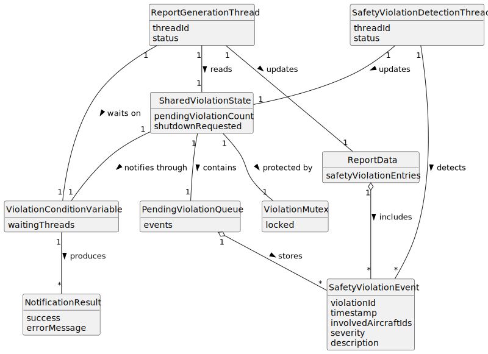

# US107 - Notify Report Thread on Safety Violation

## 2. Analysis

### 2.1. Relevant Domain Concepts

The relevant domain concepts for this user story are:

* **Safety Violation Detection Thread:** parent process thread responsible for detecting aircraft conflicts.
* **Report Generation Thread:** parent process thread responsible for compiling simulation reports and responding to safety violation events.
* **Safety Violation Event:** event created when a safety violation is detected.
* **Shared Violation State:** shared data structure containing pending violation events.
* **Violation Mutex:** mutex used to protect shared violation state.
* **Violation Condition Variable:** condition variable used to notify the report thread that new violation data is available.
* **Pending Violation Queue:** queue or buffer of violation events waiting to be processed by the report thread.
* **Thread Notification:** waking a waiting thread after a relevant event occurs.
* **Shutdown Flag:** shared state used to wake and terminate waiting threads safely.

---

### 2.2. Business Rules

* The safety violation detection thread must notify the report generation thread when a safety violation is detected.
* Shared violation data must be protected with a mutex.
* The safety thread must update shared violation data before signalling the condition variable.
* The report thread must wait on the condition variable when there are no pending violation events.
* The report thread must check a shared predicate before and after waiting.
* The report thread must read violation data under mutex protection.
* Multiple violations must be handled without overwriting unprocessed events.
* The report thread must incorporate violation events into report data.
* The report thread must be able to exit safely during simulation shutdown.
* Mutexes and condition variables must be initialized before use and destroyed during cleanup.

---

### 2.3. Preconditions

* The hybrid simulation environment must be initialized.
* The parent process must have created the safety violation detection thread.
* The parent process must have created the report generation thread.
* The violation mutex must be initialized.
* The violation condition variable must be initialized.
* Shared violation state must be initialized.

---

### 2.4. Postconditions

**Safety violation detected and notification succeeds:**

* The violation event is added to shared violation state.
* The violation condition variable is signalled.
* The report generation thread wakes up.
* The report generation thread reads the violation event.
* The violation event is included in report data.

**No violation detected:**

* No violation event is added.
* The report generation thread may continue waiting.

**Shutdown while report thread is waiting:**

* The shutdown flag is set.
* The condition variable is signalled or broadcast.
* The report generation thread wakes up and exits safely.

---

### 2.5. Domain Model

