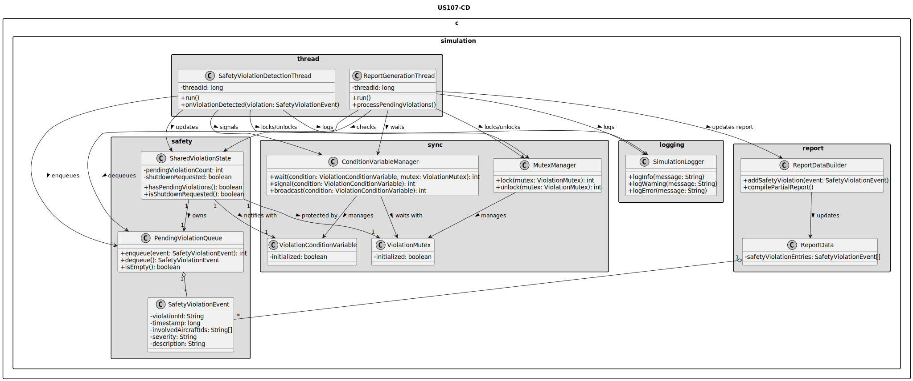
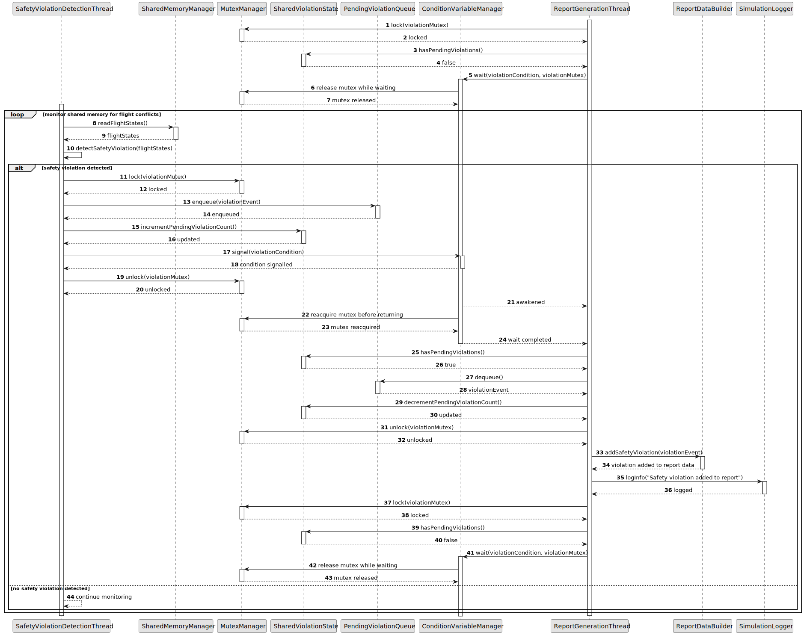

# US107 - Notify Report Thread on Safety Violation

## 3. Design

### 3.1. Responsibility Assignment

The safety violation notification process is divided between the following components:

* **SafetyViolationDetectionThread:** detects safety violations and creates violation events.
* **SharedViolationState:** stores pending violation events and shutdown state.
* **PendingViolationQueue:** keeps pending violations until the report thread consumes them.
* **ViolationMutex:** protects access to shared violation state.
* **ViolationConditionVariable:** wakes the report generation thread when new violation data is available.
* **ReportGenerationThread:** waits for violation notifications and processes pending events.
* **ReportDataBuilder:** incorporates violation events into report data.
* **ConditionVariableManager:** wraps condition variable wait/signal/broadcast operations.
* **MutexManager:** wraps mutex lock/unlock operations.
* **SimulationLogger:** logs notification and synchronization errors.

---

### 3.2. Class Diagram

---

### 3.3. Sequence Diagram

---

### 3.4. Applied Patterns

* **Producer/Consumer:** safety thread produces violation events; report thread consumes them.
* **Condition Variable Notification:** report thread sleeps until new violation data is available.
* **Mutex-protected Shared State:** shared violation state is accessed under lock.
* **Pending Queue:** prevents multiple violations from overwriting one another.
* **Shutdown Predicate:** allows waiting threads to exit safely.

---

### 3.5. Design Remarks

* The shared predicate should be something like `pendingViolationCount > 0 || shutdownRequested`.
* The report thread should wait in a `while` loop, not a simple `if`, to protect against spurious wakeups.
* The safety thread should signal only after adding the event to the queue.
* A queue is safer than a single shared violation variable because multiple violations may occur before the report thread wakes up.
* During shutdown, the parent process should signal or broadcast the condition variable.