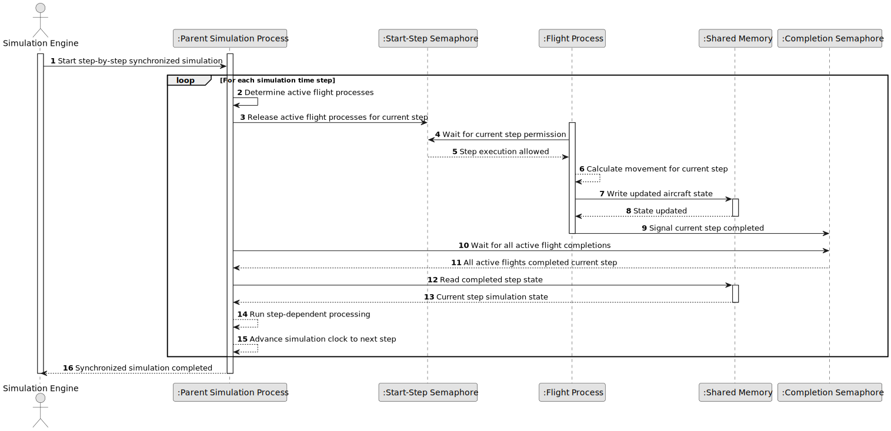

# US108 - Enforce Step-by-Step Simulation Using Semaphores

## 1. Requirements Engineering

### 1.1. User Story Description

As a simulation engine, I want to enforce step-by-step simulation using semaphores so that all flight processes advance in lockstep.

This functionality ensures that all active flight processes execute the simulation in synchronized time steps. The parent process controls when each step begins by releasing semaphores for the flight processes. Each flight process waits until it is allowed to execute the current step, calculates its new position, updates shared memory and signals completion back to the parent process.

The parent process must wait until all active flight processes have completed the current step before advancing the simulation clock to the next time step.

---

### 1.2. Customer Specifications and Clarifications

**From the specifications document:**

* The simulation must progress step by step.
* Each flight process should send position updates at defined intervals.
* The main process must ensure all updates for a given time step are processed before advancing to the next step.
* Flight processes must be configured to use semaphores for synchronization.
* The hybrid simulation component uses shared memory for inter-process communication.
* The simulation component must be implemented in C.

**From the client clarifications:**

No additional client clarifications are currently available.

---

### 1.3. Acceptance Criteria

* **AC1:** The parent process must control simulation progression by time step.
* **AC2:** The parent process must use semaphores to authorize flight processes to execute each time step.
* **AC3:** Each active flight process must wait on a start-step semaphore before executing a time step.
* **AC4:** When released, each active flight process must calculate its movement for the current step.
* **AC5:** Each active flight process must write its updated position/state to shared memory.
* **AC6:** After completing the current step, each active flight process must signal a completion semaphore.
* **AC7:** The parent process must wait for completion signals from all active flight processes.
* **AC8:** The parent process must not advance to the next time step until all active flight processes have completed the current step.
* **AC9:** Completed or terminated flight processes must no longer be expected in future step completion waits.
* **AC10:** If a flight process fails or does not signal completion, the parent process must handle the situation safely.
* **AC11:** Shared memory updates must be protected from inconsistent concurrent access.
* **AC12:** The synchronization mechanism must avoid deadlocks where possible.
* **AC13:** Semaphore initialization failure must be handled safely.
* **AC14:** Semaphore cleanup must be performed when the simulation ends.
* **AC15:** This functionality must be implemented in C.

---

### 1.4. Found out Dependencies

* This user story depends on US103, because US103 defines the time-step simulation progression.
* This user story depends on US105, because semaphores and shared memory are initialized in the hybrid simulation environment.
* This user story depends on US101, because flight processes update aircraft positions.
* This user story is related to US102, because safety violation detection should only run after all updates for a time step are complete.
* This user story is related to US106, because parent process threads may depend on complete step data.
* This user story is related to US109 and US111, because consistent time-step data is necessary for reliable reports.

---

### 1.5. Input and Output Data

**Input Data:**

* Simulation configuration:
    * Time step interval
    * Number of active flight processes
    * Flight process identifiers
    * Simulation start and end time

* Synchronization data:
    * Start-step semaphores
    * Completion semaphores
    * Active process set
    * Shared memory reference

**Output Data:**

* In case of successful step synchronization:
    * Flight processes released for current step
    * Flight processes completed current step
    * Shared memory updated with current positions
    * Simulation advanced to next step

* In case of synchronization failure:
    * Error or warning log entry
    * Failed flight process identified, when possible
    * Simulation stopped, degraded or marked as failed according to policy

---

### 1.6. System Sequence Diagram

**_Other alternatives might exist._**

---

### 1.7. Other Relevant Remarks

* This user story implements the synchronization mechanism that US103 describes conceptually.
* The parent process acts as the coordinator of the simulation step.
* Flight processes must not independently advance the global simulation clock.
* The expected process set must be updated when a flight finishes or terminates.
* Safety checks should run only after step completion is confirmed.