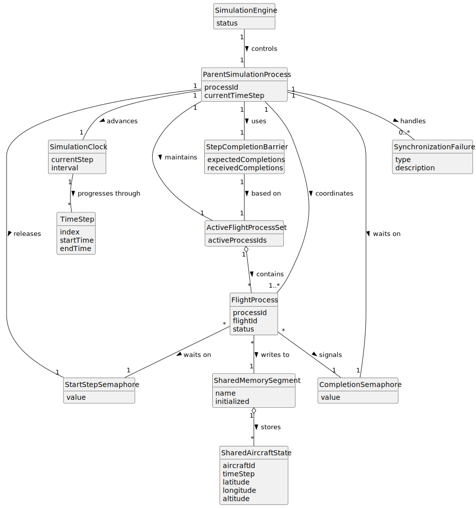

# US108 - Enforce Step-by-Step Simulation Using Semaphores

## 2. Analysis

### 2.1. Relevant Domain Concepts

The relevant domain concepts for this user story are:

* **Simulation Engine:** component responsible for controlling global simulation progression.
* **Parent Simulation Process:** process that coordinates all flight processes.
* **Flight Process:** child process that executes a flight plan step by step.
* **Time Step:** discrete interval of simulation time.
* **Start-Step Semaphore:** semaphore used by the parent process to allow flight processes to execute the current step.
* **Completion Semaphore:** semaphore used by flight processes to notify the parent process that their step is complete.
* **Active Flight Process Set:** set of flight processes expected to execute the current time step.
* **Shared Memory:** memory area where flight processes write their updated state.
* **Step Completion Barrier:** synchronization point where the parent process waits for all active flight processes.
* **Synchronization Failure:** missing, delayed or failed step completion.
* **Simulation Clock:** current simulation time step controlled by the parent process.

---

### 2.2. Business Rules

* The parent process controls the simulation clock.
* The simulation progresses one step at a time.
* Active flight processes must wait for permission before executing a step.
* Semaphores must be used to release flight processes for each step.
* Each active flight process must update shared memory during its step.
* Each active flight process must signal completion after updating shared memory.
* The parent process must wait for all expected completion signals.
* The parent process must not advance before all active flight processes complete the current step.
* Completed or terminated flight processes must be removed from the active expected set.
* Synchronization failures must be handled safely.
* Semaphores must be initialized before simulation execution and destroyed during cleanup.

---

### 2.3. Preconditions

* The hybrid simulation environment must be initialized.
* Shared memory must be allocated and initialized.
* Semaphores must be initialized.
* Flight processes must be created.
* The simulation clock must be initialized.
* The active flight process set must be known.

---

### 2.4. Postconditions

**Successful time step execution:**

* Active flight processes execute the current time step.
* Shared memory contains updated aircraft states.
* All active flight processes signal completion.
* Parent process performs step-dependent processing.
* Parent process advances the simulation clock.

**Flight process completed:**

* The flight process is removed from the active expected set.
* The parent process no longer waits for it in later steps.

**Synchronization failure:**

* The failure is logged or reported.
* The parent process avoids advancing with inconsistent data unless a defined failure policy allows it.
* The simulation may be stopped or marked as failed.

---

### 2.5. Domain Model

