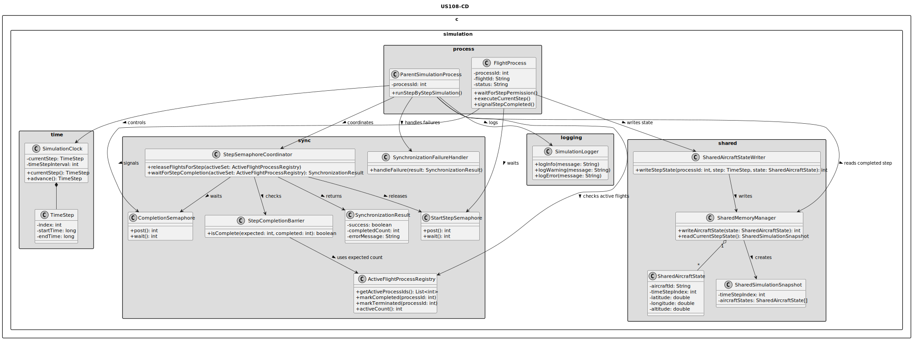
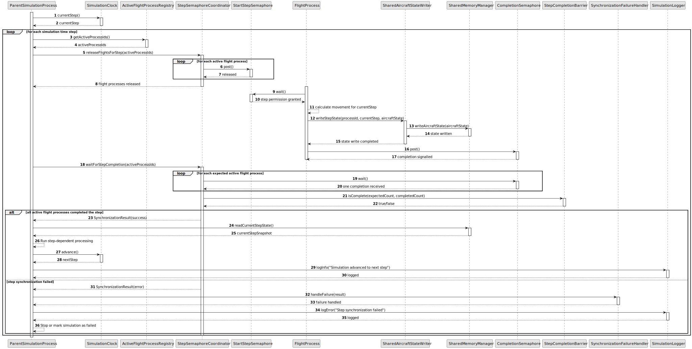

# US108 - Enforce Step-by-Step Simulation Using Semaphores

## 3. Design

### 3.1. Responsibility Assignment

The semaphore-based step synchronization process is divided between the following components:

* **ParentSimulationProcess:** coordinates the simulation step progression.
* **SimulationClock:** stores and advances the current time step.
* **ActiveFlightProcessRegistry:** tracks which flight processes are active and expected to participate in each step.
* **StepSemaphoreCoordinator:** coordinates semaphore release and completion waits.
* **StartStepSemaphore:** allows flight processes to begin executing a step.
* **CompletionSemaphore:** allows flight processes to notify that a step is completed.
* **FlightProcess:** waits for step permission, executes movement, writes state and signals completion.
* **SharedMemoryManager:** provides access to shared simulation data.
* **SharedAircraftStateWriter:** writes updated aircraft state into shared memory.
* **StepCompletionBarrier:** determines whether all expected flight processes completed the current step.
* **SynchronizationFailureHandler:** handles missing or failed completion events.
* **SimulationLogger:** logs step synchronization events and failures.

---

### 3.2. Class Diagram

---

### 3.3. Sequence Diagram

---

### 3.4. Applied Patterns

* **Semaphore Synchronization:** uses semaphores to coordinate parent and child process execution.
* **Step Barrier:** parent process waits until all expected processes complete the current step.
* **Lockstep Simulation:** all active flights progress together one time step at a time.
* **Registry:** tracks active flight processes.
* **Failure Handler:** isolates synchronization failure handling.
* **Shared Memory Writer:** separates aircraft state writing from process coordination.

---

### 3.5. Design Remarks

* The parent process owns the simulation clock.
* Flight processes should never advance the global simulation clock.
* Flight processes should block on a start-step semaphore before calculating movement.
* Flight processes should signal completion only after shared memory is updated.
* The active process registry must be updated when flights complete.
* Safety detection should happen after the completion barrier is satisfied.