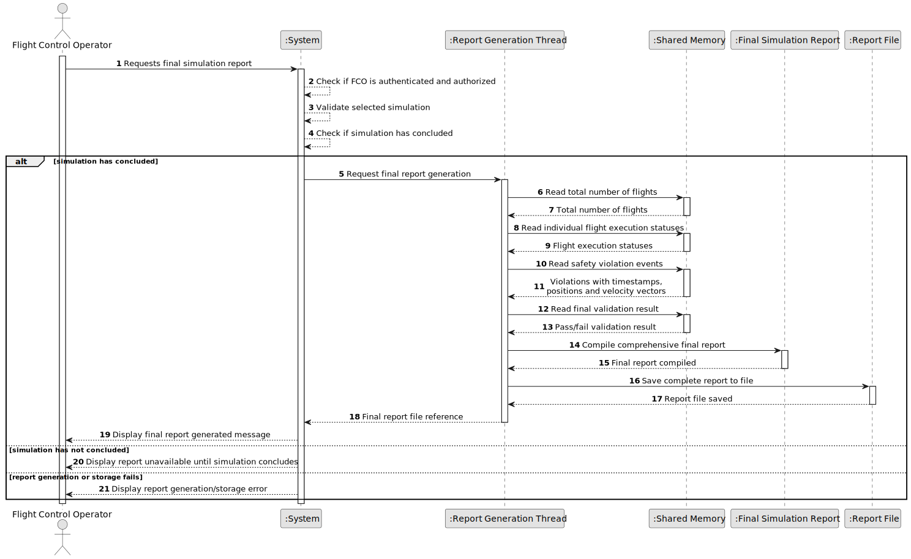

# US109 - Generate Simulation Report

## 1. Requirements Engineering

### 1.1. User Story Description

As a Flight Control Operator, I want to generate a simulation report so that I can analyze the execution results of the simulated flights.

This functionality allows a Flight Control Operator to obtain a report describing the outcome of a simulation. The report should include relevant simulation data, such as the simulation configuration, included flight plans, aircraft positions over time, safety violations, process status, warnings, errors and final simulation result.

The report may be generated during or after the simulation, depending on the implementation. Since the parent process includes a report generation thread, this thread should compile and maintain report data as simulation events occur.

---

### 1.2. Customer Specifications and Clarifications

**From the specifications document:**

* The parent process must include a report generation thread.
* The report generation thread is responsible for compiling simulation results.
* The report generation thread responds to safety violation events.
* Simulation results depend on flight processes, shared memory, safety violation detection and step synchronization.
* Threads must be managed using mutexes and condition variables for internal synchronization.

**From the client clarifications:**

No additional client clarifications are currently available.

---

### 1.3. Acceptance Criteria

* **AC1:** A Flight Control Operator must be able to generate or obtain a simulation report.
* **AC2:** The Flight Control Operator must be authenticated and authorized, if the report is requested through the application layer.
* **AC3:** The selected simulation must exist.
* **AC4:** The report must include simulation identification or metadata.
* **AC5:** The report must include simulation configuration.
* **AC6:** The report must include the included flights or flight plans.
* **AC7:** The report must include aircraft position data or a summary of aircraft movement.
* **AC8:** The report must include safety violation events.
* **AC9:** The report must include the number of detected safety violations.
* **AC10:** The report must include flight process status information.
* **AC11:** The report must include warnings or errors generated during simulation.
* **AC12:** The report must include the final simulation outcome.
* **AC13:** Report data must be read safely from shared simulation data.
* **AC14:** Shared report data must be protected by mutexes where necessary.
* **AC15:** The report generation thread must be able to update report data when safety violation events occur.
* **AC16:** The report must not contain inconsistent partial data from an unfinished time step.
* **AC17:** If report generation fails, the system must provide a meaningful error message.
* **AC18:** This functionality must be implemented consistently with the C simulation component.

---

### 1.4. Found out Dependencies

* This user story depends on US105, because the hybrid simulation environment and shared memory must exist.
* This user story depends on US106, because the report generation thread must exist.
* This user story depends on US107, because safety violation events notify the report generation thread.
* This user story depends on US108, because the report should use consistent step-by-step simulation data.
* This user story is related to US101, because aircraft movement data is part of the report.
* This user story is related to US102, because safety violation events are included in the report.
* This user story is related to US111, because later reports may become more complete or exported in specific formats.
* This user story is related to US113 and US114, because report data may later be logged or visualized remotely.

---

### 1.5. Input and Output Data

**Input Data:**

* Selected data:
    * Simulation identifier

* Simulation data sources:
    * Simulation configuration
    * Included flight plans
    * Shared aircraft states
    * Position history
    * Safety violation events
    * Flight process statuses
    * Warnings and errors
    * Final simulation status

**Output Data:**

* In case of success:
    * Simulation report, including:
        * simulation metadata;
        * configuration summary;
        * included flights;
        * movement/position summary;
        * safety violation summary;
        * process status summary;
        * warnings and errors;
        * final outcome.

* In case of failure:
    * Error message explaining why the report could not be generated.

---

### 1.6. System Sequence Diagram

**_Other alternatives might exist._**

---

### 1.7. Other Relevant Remarks

* This report is primarily a simulation execution report.
* The detailed format may later be refined.
* The report generation thread should not directly perform safety detection.
* The report should only use complete and consistent simulation data.
* If the simulation is still running, the report may represent a partial/current snapshot.