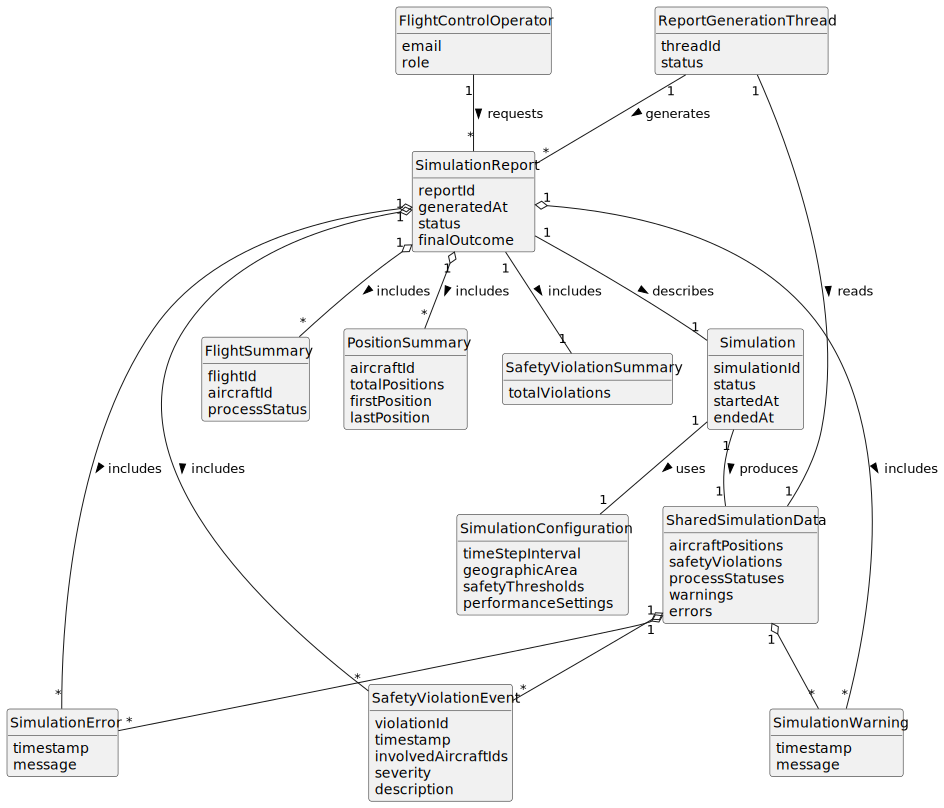

# US109 - Generate Simulation Report

## 2. Analysis

### 2.1. Relevant Domain Concepts

The relevant domain concepts for this user story are:

* **Flight Control Operator:** user who requests or consults the simulation report.
* **Simulation:** execution instance whose results are being reported.
* **Report Generation Thread:** dedicated parent process thread responsible for compiling simulation results.
* **Simulation Report:** structured summary of simulation execution.
* **Shared Memory:** source of simulation state and data.
* **Simulation Configuration:** parameters used to run the simulation.
* **Included Flight:** flight or flight plan included in the simulation.
* **Aircraft Position History:** recorded positions over simulation time.
* **Safety Violation Event:** detected violation included in the report.
* **Flight Process Status:** execution status of each flight process.
* **Simulation Warning/Error:** relevant issue detected during simulation.
* **Final Simulation Outcome:** final status of the simulation.

---

### 2.2. Business Rules

* The report generation thread must aggregate data only once the simulation concludes.
* The report must include the total number of flights.
* The report must include individual flight execution statuses.
* The report must include detailed safety violation events.
* Each safety violation event must include timestamp, position and velocity vector data.
* The report must clearly indicate the final validation result as pass or fail.
* The complete report must be saved to a file for future reference.
* If the simulation has not concluded, the final stored report must not be generated.

---

### 2.3. Preconditions

* The simulation must exist.
* Shared simulation data must be available.
* The report generation thread must be initialized.
* Relevant simulation data must have been collected or be available for snapshot generation.
* Required synchronization primitives must be available for safe reads.

---

### 2.4. Postconditions

**Successful report generation:**

* Simulation data is read safely.
* A simulation report is compiled.
* The report includes relevant simulation results.
* The report is returned or displayed to the Flight Control Operator.

**Partial report generation:**

* If the simulation is still running, a snapshot report is produced.
* The report indicates that the simulation is not yet complete.

**Failed report generation:**

* No invalid report is returned.
* A meaningful error message is displayed.
* The failure is logged or reported.

---

### 2.5. Domain Model

