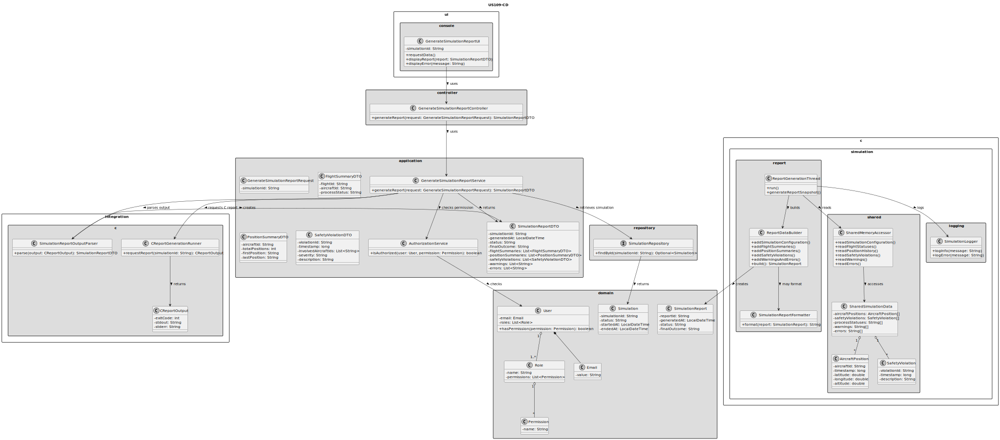
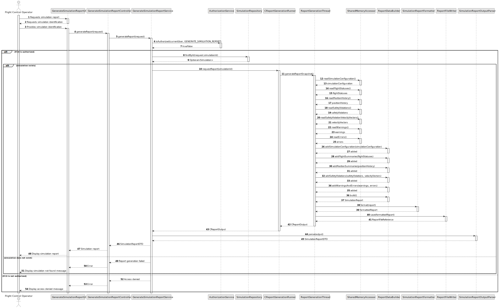

# US109 - Generate Simulation Report

## 3. Design

### 3.1. Responsibility Assignment

The simulation report generation process is divided between the following components:

* **GenerateSimulationReportUI:** interacts with the Flight Control Operator and requests the selected simulation.
* **GenerateSimulationReportController:** receives the report request.
* **GenerateSimulationReportService:** coordinates authorization, simulation lookup and report retrieval/generation.
* **AuthorizationService:** verifies if the current user can generate simulation reports.
* **SimulationRepository:** retrieves simulation metadata, if stored on the application side.
* **CReportGenerationRunner:** communicates with or invokes the C simulation report component when needed.
* **ReportGenerationThread:** compiles report data inside the C simulation component.
* **SharedMemoryAccessor:** reads shared simulation data safely.
* **ReportDataBuilder:** builds the report structure.
* **SimulationReport:** domain/result object representing the generated report.
* **SimulationReportDTO:** transfers report data to the UI.
* **SimulationReportFormatter:** formats report data for display or export.
* **SimulationLogger:** logs report generation errors.

---

### 3.2. Class Diagram

---

### 3.3. Sequence Diagram

---

### 3.4. Applied Patterns

* **Report Generation Thread:** compiles simulation report data concurrently with simulation execution.
* **DTO:** transfers report data to the UI.
* **Builder:** incrementally constructs a structured simulation report.
* **Shared Memory Accessor:** centralizes safe access to shared simulation data.
* **Formatter:** separates report structure from presentation.
* **Repository:** retrieves persisted simulation metadata when required.
* **Adapter:** isolates Java/application layer from C report output.

---

### 3.5. Design Remarks

* The report generation thread should read shared data under synchronization where needed.
* The report should not include inconsistent data from an incomplete time step.
* Safety violation events should be included through the report data updated by US107.
* This US defines the report generation functionality, while later USs may refine the exact report format/export.
* If the simulation is still running, the report should clearly identify itself as a partial snapshot.