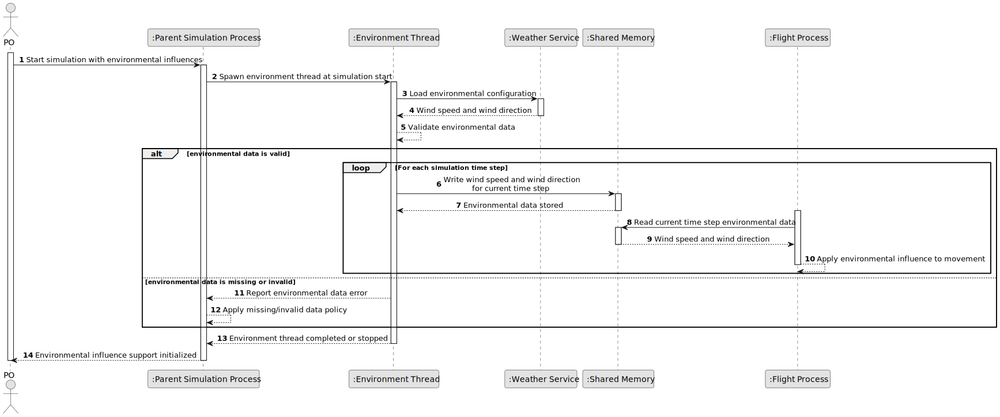

# US110 - Incorporate Environmental Influences into the Simulation

## 1. Requirements Engineering

### 1.1. User Story Description

As a simulation engine, I want to incorporate environmental influences into the simulation so that flight behaviour reflects relevant weather and environmental conditions.

This functionality allows the simulation to use environmental data while flights are being executed. Environmental influences may affect aircraft movement, fuel consumption, safety evaluation or simulation reporting.

The simulation must retrieve or receive environmental data, make it available to the simulation components and apply the relevant influence calculations during each simulation time step.

---

### 1.2. Customer Specifications and Clarifications

**From the specifications document:**

* The simulation must consider environmental influences.
* Weather data may be associated with flight plans.
* Weather data can affect simulation results.
* The hybrid simulation uses shared memory for inter-process communication.
* The simulation progresses step by step.
* Simulation data is used for safety violation detection and reporting.

**From the client clarifications:**

No additional client clarifications are currently available.

---

### 1.3. Acceptance Criteria

* **AC1:** The simulation must be able to use environmental data during execution.
* **AC2:** Environmental data must be available before it is applied to flight movement calculations.
* **AC3:** Environmental data must be associated with a simulation area, flight plan, time step or relevant air control area.
* **AC4:** The system must validate environmental data before applying it.
* **AC5:** Invalid environmental data must not be applied to flight calculations.
* **AC6:** Environmental influences may affect aircraft movement.
* **AC7:** Environmental influences may affect fuel consumption.
* **AC8:** Environmental influences may affect safety evaluation.
* **AC9:** Environmental influences must be applied consistently within a simulation time step.
* **AC10:** Flight processes must access environmental data safely.
* **AC11:** Environmental data shared between parent and child processes must be stored in shared memory or provided through an equivalent controlled mechanism.
* **AC12:** Updates to environmental data must not corrupt simulation state.
* **AC13:** Environmental influence application must be logged or reflected in the simulation report where relevant.
* **AC14:** If environmental data is missing, the system must either use default conditions or report the missing data according to the defined simulation policy.
* **AC15:** This functionality must be implemented consistently with the C simulation component.

---

### 1.4. Found out Dependencies

* This user story depends on US041 and US042, because weather data may be registered or imported.
* This user story depends on US043, because weather data may be consulted by day and air control area.
* This user story depends on US082, because flight plans may include weather data.
* This user story depends on US105, because the hybrid simulation environment and shared memory must exist.
* This user story depends on US108, because environmental influences should be applied consistently per time step.
* This user story is related to US100, because it extends the base simulation.
* This user story is related to US101, because environmental influences may affect movement updates.
* This user story is related to US102, because environmental conditions may affect safety violation detection.
* This user story is related to US109 and US111, because reports should include relevant environmental effects.

---

### 1.5. Input and Output Data

**Input Data:**

* Environmental data:
    * Wind speed
    * Wind direction
    * Temperature
    * Pressure
    * Visibility
    * Precipitation
    * Severe weather indicators, if applicable

* Context data:
    * Simulation area
    * Air control area
    * Time step
    * Flight plan
    * Aircraft state

**Output Data:**

* In case of successful application:
    * Adjusted aircraft movement data
    * Adjusted fuel consumption data, if applicable
    * Environmental influence entries in simulation state or report

* In case of missing or invalid environmental data:
    * Warning or error entry
    * Default environmental conditions, if allowed
    * Simulation continuation or failure according to policy

---

### 1.6. System Sequence Diagram

**_Other alternatives might exist._**

---

### 1.7. Other Relevant Remarks

* This user story should not duplicate weather registration or import logic.
* Weather data should be validated before use.
* The environmental influence model may start simple and become more detailed later.
* The same environmental data should be applied consistently across all relevant flight processes for a given time step.
* Reports should mention environmental conditions when they affect simulation results.