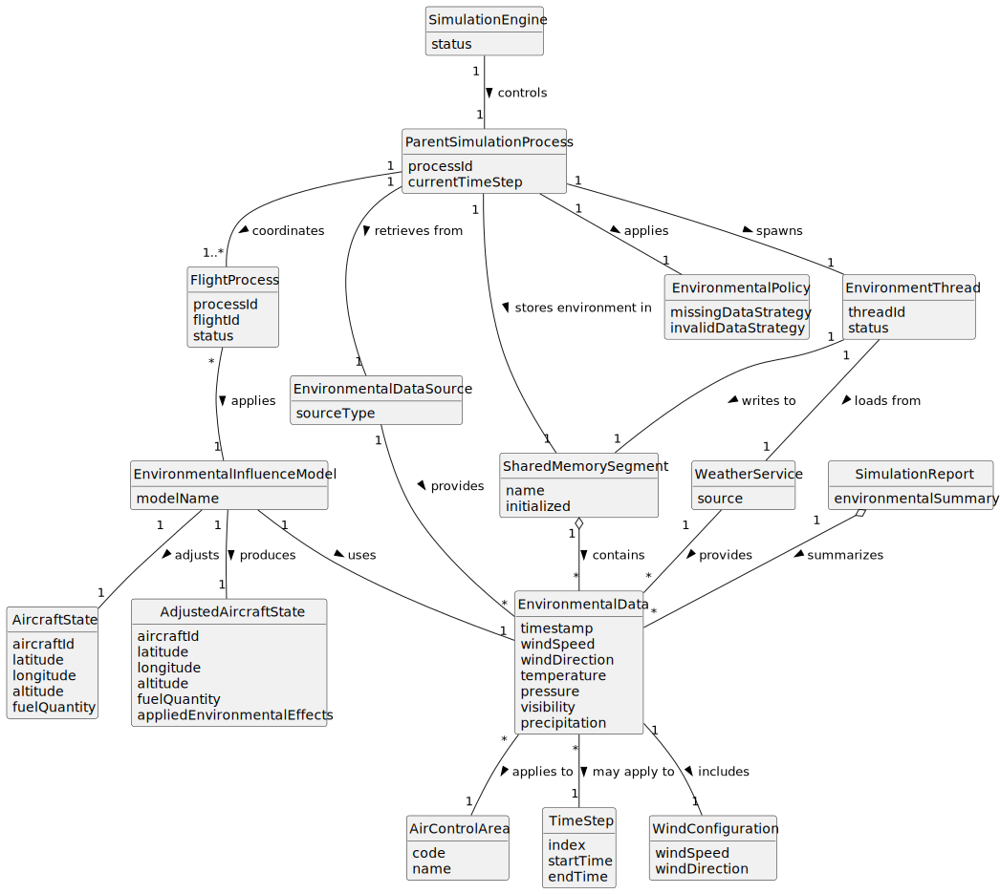

# US110 - Incorporate Environmental Influences into the Simulation

## 2. Analysis

### 2.1. Relevant Domain Concepts

The relevant domain concepts for this user story are:

* **Simulation Engine:** component responsible for controlling simulation execution.
* **Parent Simulation Process:** process that prepares and coordinates shared simulation data.
* **Flight Process:** child process that applies environmental influences while calculating flight movement.
* **Environmental Data:** weather or environmental conditions used by the simulation.
* **Wind Influence:** effect of wind speed and direction on aircraft movement.
* **Atmospheric Influence:** effect of temperature or pressure on simulation calculations.
* **Visibility Influence:** environmental condition that may affect safety analysis or report data.
* **Environmental Data Source:** source from which environmental conditions are retrieved.
* **Shared Memory:** memory area where environmental data may be stored for use by flight processes.
* **Environmental Influence Model:** calculation logic that applies environmental effects to aircraft state.
* **Environmental Policy:** rule defining what happens when environmental data is missing or invalid.

---

### 2.2. Business Rules

* Environmental data must be validated before being applied.
* Environmental data must correspond to the simulation context.
* Environmental data may be associated with an air control area, simulation area, flight plan or time step.
* Flight processes must apply relevant environmental influences when calculating movement.
* Environmental influences must be applied consistently within a time step.
* Missing environmental data must be handled according to a defined policy.
* Invalid environmental data must not corrupt simulation state.
* Environmental influence effects should be reflected in simulation reports when relevant.
* Access to shared environmental data must be synchronized where needed.
* Environmental data updates must not conflict with step-by-step simulation synchronization.

---

### 2.3. Preconditions

* The simulation must be running or ready to start.
* Environmental data must be available or a missing-data policy must exist.
* Shared memory must be initialized if environmental data is shared through it.
* Flight processes must be able to access environmental data.
* Time-step synchronization must be available if environmental data changes per step.

---

### 2.4. Postconditions

**Successful environmental influence application:**

* Environmental data is validated.
* Environmental data is made available to the relevant simulation components.
* Flight processes apply environmental influences during movement calculation.
* Adjusted aircraft state is stored.
* Relevant environmental effects are included in the simulation report.

**Missing environmental data:**

* The missing-data policy is applied.
* The simulation either continues with defaults or reports the issue.
* A warning or error is logged.

**Invalid environmental data:**

* Invalid data is rejected.
* Invalid data is not applied to flight calculations.
* A warning or error is logged.
* The simulation proceeds or fails according to policy.

---

### 2.5. Domain Model

