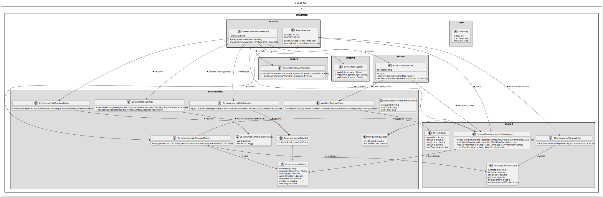
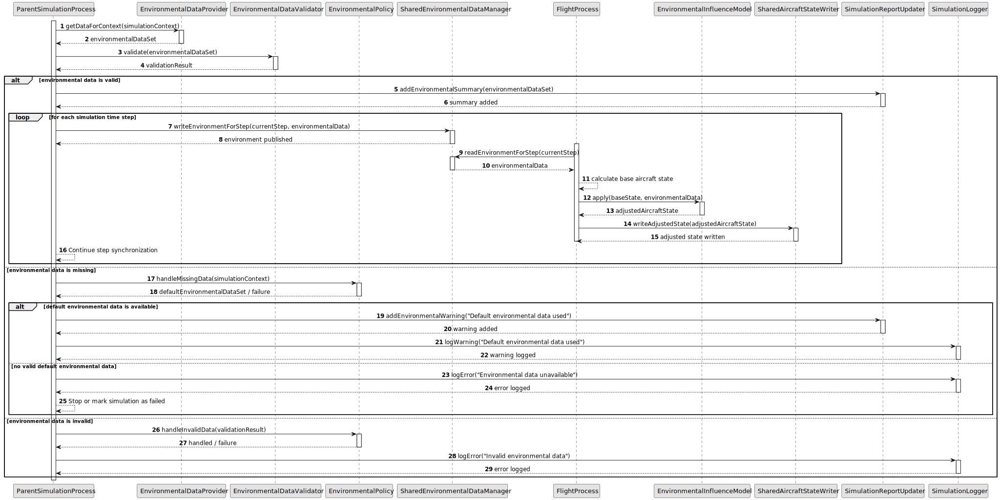

# US110 - Incorporate Environmental Influences into the Simulation

## 3. Design

### 3.1. Responsibility Assignment

The environmental influence process is divided between the following components:

* **ParentSimulationProcess:** coordinates environmental data preparation and publication to shared memory.
* **EnvironmentalDataProvider:** retrieves environmental data for the simulation context.
* **EnvironmentalDataValidator:** validates environmental data before use.
* **EnvironmentalPolicy:** decides how missing or invalid data is handled.
* **SharedEnvironmentalDataManager:** stores and retrieves environmental data in shared memory.
* **FlightProcess:** reads environmental data and applies it during movement calculation.
* **EnvironmentalInfluenceModel:** calculates the effects of environmental conditions on aircraft state.
* **AircraftStateCalculator:** calculates aircraft state for the current time step.
* **SharedAircraftStateWriter:** writes adjusted aircraft state to shared memory.
* **SimulationReportUpdater:** records relevant environmental effects in the simulation report.
* **SimulationLogger:** logs missing, invalid or applied environmental data events.

---

### 3.2. Class Diagram

---

### 3.3. Sequence Diagram

---

### 3.4. Applied Patterns

* **Provider:** retrieves environmental data from existing weather/environment sources.
* **Validator:** ensures environmental data is safe to apply.
* **Policy:** handles missing or invalid environmental data.
* **Shared Memory Manager:** centralizes access to environmental data in shared memory.
* **Influence Model:** isolates environmental effect calculations.
* **Time-Step Application:** applies environmental data consistently within each simulation step.
* **Report Updater:** records environmental influence effects for later analysis.

---

### 3.5. Design Remarks

* Environmental data should be validated before being written to shared memory.
* Flight processes should read environmental data for the current time step only.
* If environmental data changes over time, the parent process should publish the correct data per step.
* The influence model should initially be simple and deterministic.
* Missing data should not silently produce misleading simulation results.
* Report data should mention whether default environmental conditions were used.