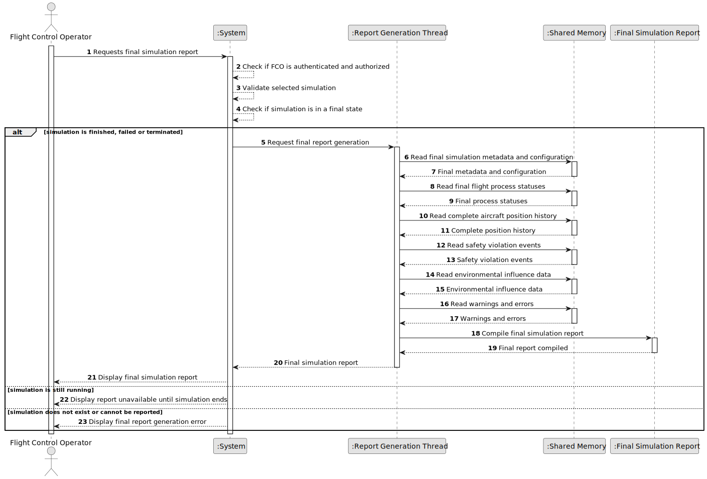

# US111 - Generate Final Simulation Report

## 1. Requirements Engineering

### 1.1. User Story Description

As a Flight Control Operator, I want to receive a summary of the simulation results so that I can determine if the programmed flights are safe to run.

This functionality generates a simulation report focused on the safety decision of the scheduled flight plan. The report must summarize the simulation results and indicate clearly whether the programmed flights passed or failed validation.

The system must generate the report and store it in a file. The report should include the total number of flights, their execution status, safety violation timestamps and positions, and the final pass/fail validation result.

---

### 1.2. Customer Specifications and Clarifications

**From the specifications document:**

* The simulation system must produce simulation results.
* The parent process includes a report generation thread.
* The report generation thread is responsible for compiling simulation results.
* The report generation thread responds to safety violation events.
* Safety violation events must be logged and reflected in simulation results.
* Environmental influences may affect simulation results.
* Simulation progress is synchronized step by step.
* Simulation data is stored or coordinated through shared memory.

**From the client clarifications:**

No additional client clarifications are currently available.

---

### 1.3. Acceptance Criteria

* **AC1:** A Flight Control Operator must be able to receive a summary of the simulation results.
* **AC2:** The Flight Control Operator must be authenticated and authorized, if the report is requested through the application layer.
* **AC3:** The selected simulation must exist.
* **AC4:** The system must generate a simulation report.
* **AC5:** The system must store the report in a file.
* **AC6:** The report must include the total number of flights.
* **AC7:** The report must include the execution status of the flights.
* **AC8:** If safety violations occur, the report must list their timestamps.
* **AC9:** If safety violations occur, the report must list their positions.
* **AC10:** The report must indicate whether the scheduled flights plan passed or failed validation.
* **AC11:** The report must be clear enough for the Flight Control Operator to determine whether the programmed flights are safe to run.
* **AC12:** If report generation or storage fails, the system must provide a meaningful error message.

---

### 1.4. Found out Dependencies

* This user story depends on US101, because aircraft movement and position data may be included in the report.
* This user story depends on US102, because safety violation timestamps and positions must be reported.
* This user story depends on US108, because report data should be based on synchronized simulation steps.
* This user story depends on US109, because US109 defines the comprehensive final report generation and storage mechanism.
* This user story is related to US110, because environmental influences may affect the simulation result.

---

### 1.5. Input and Output Data

**Input Data:**

* Selected data:
    * Simulation identifier

* Final simulation data:
    * Simulation metadata
    * Simulation configuration
    * Included flight plans
    * Final flight process statuses
    * Aircraft position history
    * Safety violation events
    * Environmental influence data
    * Warnings
    * Errors
    * Final simulation status

**Output Data:**

* In case of success:
    * Final simulation report, including:
        * simulation metadata;
        * configuration summary;
        * included flight summary;
        * final process status summary;
        * aircraft movement/position summary;
        * safety violation summary;
        * environmental influence summary;
        * warning/error summary;
        * final simulation outcome.

* In case of failure:
    * Error message explaining why the final report could not be generated.

---

### 1.6. System Sequence Diagram

**_Other alternatives might exist._**

---

### 1.7. Other Relevant Remarks

* US109 may be used for partial or snapshot reports.
* US111 should represent the final, consolidated report after simulation execution ends.
* If the simulation was terminated early due to safety violations, the final report must state that.
* The final report should be generated from complete and synchronized simulation data.