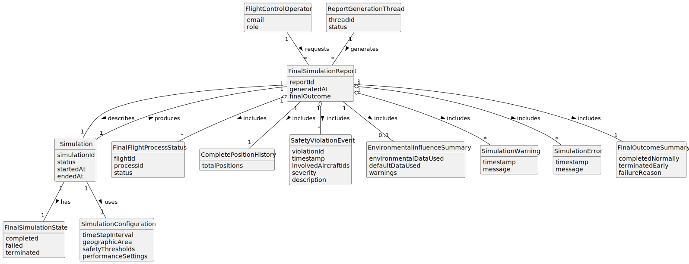

# US111 - Generate Final Simulation Report

## 2. Analysis

### 2.1. Relevant Domain Concepts

The relevant domain concepts for this user story are:

* **Flight Control Operator:** user who requests the final simulation report.
* **Simulation:** execution instance whose final result is reported.
* **Final Simulation State:** state indicating that the simulation finished, failed or was terminated.
* **Report Generation Thread:** dedicated thread that compiles simulation results.
* **Final Simulation Report:** complete report generated after simulation execution ends.
* **Simulation Configuration:** parameters used to run the simulation.
* **Flight Process Status:** final execution status of each flight process.
* **Aircraft Position History:** complete position history collected during simulation.
* **Safety Violation Event:** violation detected during simulation.
* **Environmental Influence Data:** environmental data and effects applied during simulation.
* **Simulation Warning:** warning generated during simulation.
* **Simulation Error:** error generated during simulation.
* **Final Simulation Outcome:** final classification of simulation result.

---

### 2.2. Business Rules

* Only an authorized Flight Control Operator can request the final report through the application layer.
* The selected simulation must exist.
* The selected simulation must be in a final state.
* A running simulation should not produce a final report.
* The final report must include complete and consistent simulation data.
* The final report must include simulation metadata and configuration.
* The final report must include included flights and final flight process statuses.
* The final report must include aircraft movement or position information.
* The final report must include all safety violation events.
* The final report must include total safety violation count.
* The final report must include environmental influence information when applicable.
* The final report must include warnings and errors.
* The final report must include whether the simulation completed normally, failed or was terminated early.
* Final report generation must avoid incomplete time-step data.

---

### 2.3. Preconditions

* The simulation must exist.
* The simulation must have reached a final state.
* The report generation thread must be available.
* Shared simulation data must contain complete simulation results.
* Required synchronization mechanisms must allow safe access to final data.

---

### 2.4. Postconditions

**Successful final report generation:**

* Complete simulation data is read safely.
* A final report is compiled.
* The final report includes the final outcome and all required summaries.
* The final report is returned or displayed to the Flight Control Operator.

**Simulation still running:**

* No final report is generated.
* The system informs the user that the final report is only available after simulation completion.

**Failed final report generation:**

* No misleading final report is returned.
* The failure is logged or reported.
* A meaningful error message is displayed.

---

### 2.5. Domain Model

