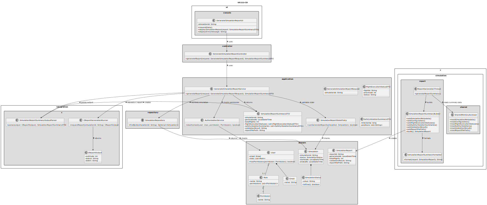
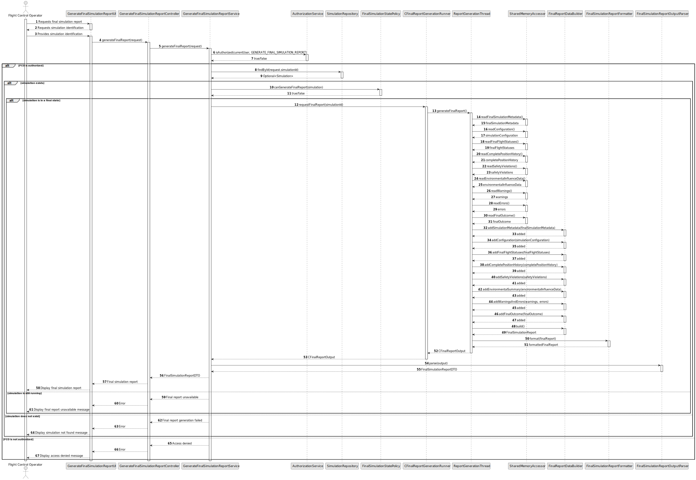

# US111 - Generate Final Simulation Report

## 3. Design

### 3.1. Responsibility Assignment

The final simulation report generation process is divided between the following components:

* **GenerateFinalSimulationReportUI:** interacts with the Flight Control Operator and requests the selected simulation.
* **GenerateFinalSimulationReportController:** receives the final report request.
* **GenerateFinalSimulationReportService:** coordinates authorization, simulation lookup, final-state validation and report generation.
* **AuthorizationService:** verifies whether the current user can generate final simulation reports.
* **SimulationRepository:** retrieves simulation metadata and status.
* **FinalSimulationStatePolicy:** checks whether a final report may be generated.
* **CFinalReportGenerationRunner:** requests or retrieves the C-generated final report.
* **ReportGenerationThread:** compiles final simulation data.
* **FinalReportDataBuilder:** builds the final report structure.
* **SharedMemoryAccessor:** reads complete shared simulation data safely.
* **FinalSimulationReportFormatter:** formats the final report.
* **FinalSimulationReportOutputParser:** parses final report output into an application DTO.
* **FinalSimulationReportDTO:** transfers the final report to the UI.
* **SimulationLogger:** logs final report generation errors.

---

### 3.2. Class Diagram

---

### 3.3. Sequence Diagram

---

### 3.4. Applied Patterns

* **Final-State Policy:** prevents final report generation before simulation completion.
* **Report Builder:** builds a complete final report.
* **Shared Memory Accessor:** centralizes safe reads from shared simulation data.
* **DTO:** transfers final report data to the application/UI layer.
* **Formatter:** separates report content from presentation/export format.
* **Adapter:** isolates the Java/application layer from the C report generation component.

---

### 3.5. Design Remarks

* US111 should reuse much of the US109 report structure.
* The main distinction is that US111 requires a final simulation state.
* A final report should not be generated from a running simulation.
* If the simulation terminated early due to safety violations, the final report must explicitly state that.
* Final report generation should happen after the final time step has been completed or after termination/failure has been finalized.