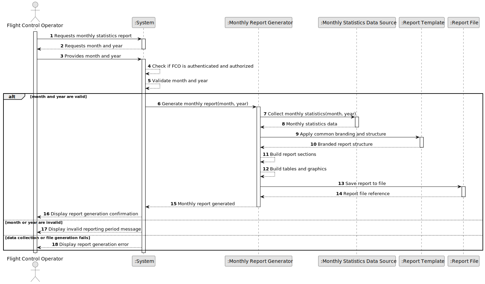

# US112 - Monthly Report Generation

## 1. Requirements Engineering

### 1.1. User Story Description

As a Flight Control Operator, I want to generate a monthly statistics report.

This functionality allows a Flight Control Operator to generate a statistical report for a selected month. The report should summarize relevant monthly data related to simulations, flights, safety violations, validation outcomes and other operational indicators.

This user story is also foundational for future report types. The reporting infrastructure should support different report types, each with its own data collection strategy, sections and graphical elements, while preserving consistent branding and structure across all generated reports.

---

### 1.2. Customer Specifications and Clarifications

**From the specifications document:**

* A Flight Control Operator wants to generate a monthly statistics report.
* This is one of several reports the system will have to generate in the future.
* Future reports may include compliance reports, incident reports and other types.
* This work should be foundational so that all reports follow consistent branding and structure.
* Each report type may have:
    * a specific way of collecting data;
    * specific sections;
    * specific graphics.

**From the client clarifications:**

No additional client clarifications are currently available.

---

### 1.3. Acceptance Criteria

* **AC1:** A Flight Control Operator must be able to generate a monthly statistics report.
* **AC2:** The Flight Control Operator must be authenticated and authorized.
* **AC3:** The Flight Control Operator must provide or select the month and year of the report.
* **AC4:** The selected month and year must be valid.
* **AC5:** The system must collect the data required for the monthly statistics report.
* **AC6:** The report must summarize relevant monthly statistics.
* **AC7:** The report must include a consistent report header.
* **AC8:** The report must include a consistent report footer.
* **AC9:** The report must follow the system's report branding rules.
* **AC10:** The report must follow the system's common report structure.
* **AC11:** The monthly report must be generated through a reusable reporting infrastructure.
* **AC12:** The reporting infrastructure must support different report types.
* **AC13:** Each report type must be able to define its own data collection strategy.
* **AC14:** Each report type must be able to define its own sections.
* **AC15:** Each report type must be able to define its own graphics or visual elements.
* **AC16:** The generated report must include the report type.
* **AC17:** The generated report must include the reporting period.
* **AC18:** The generated report must include the generation date/time.
* **AC19:** The generated report must be saved to a file.
* **AC20:** If there is no data for the selected month, the report must still be generated with an explicit no-data indication.
* **AC21:** If data collection fails, the system must display a meaningful error message.
* **AC22:** If report file generation fails, the system must display a meaningful error message.

---

### 1.4. Found out Dependencies

* This user story depends on US030, because authentication and authorization must be enforced.
* This user story is related to US100, because monthly statistics may include air control simulation executions.
* This user story is related to US102, because safety violation statistics may be included.
* This user story is related to US109, because final simulation reports may provide data for monthly statistics.
* This user story is related to US111, because generated simulation reports may contribute to monthly summaries.
* This user story is related to future compliance and incident report user stories, because this US establishes reusable reporting structure and branding.
* This user story is related to NFR02, because technical documentation must be maintained in the repository.
* This user story is related to NFR08, because report data may come from configured persistence.

---

### 1.5. Input and Output Data

**Input Data:**

* Selected data:
    * Report month
    * Report year

* Implicit data:
    * Authenticated user
    * Report type
    * Available simulation records
    * Available flight records
    * Available safety violation records
    * Available validation results
    * Available incident/compliance data, when applicable in the future

**Output Data:**

* In case of success:
    * Monthly statistics report
    * Report file reference/path
    * Report generation confirmation

* The monthly statistics report may include:
    * Report title
    * Report type
    * Reporting period
    * Generation date/time
    * Branding/header/footer
    * Executive summary
    * Total simulations in the month
    * Total flights simulated in the month
    * Total safety violations
    * Validation pass/fail statistics
    * Relevant monthly trends
    * Tables and/or graphical elements
    * No-data indication, when applicable

* In case of failure:
    * Error message explaining why the report could not be generated or stored

---

### 1.6. System Sequence Diagram

**_Other alternatives might exist._**

---

### 1.7. Other Relevant Remarks

* This user story should establish a reusable reporting infrastructure.
* The monthly statistics report is the first concrete report type in this extensible reporting model.
* Branding and structure should not be duplicated in every future report implementation.
* Future report types should plug into the same reporting pipeline by providing their own data collector, sections and graphics.