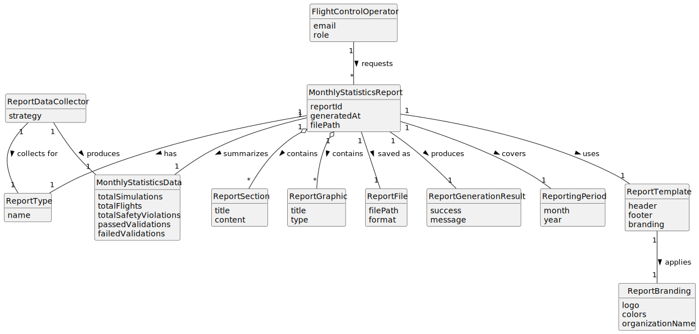

# US112 - Monthly Report Generation

## 2. Analysis

### 2.1. Relevant Domain Concepts

The relevant domain concepts for this user story are:

* **Flight Control Operator:** user who requests the monthly statistics report.
* **Monthly Statistics Report:** report summarizing relevant statistics for a selected month.
* **Reporting Period:** month and year covered by the report.
* **Report Type:** category of report, such as monthly statistics, compliance or incident report.
* **Report Template:** common structure and branding applied to generated reports.
* **Report Branding:** consistent visual and textual identity used across reports.
* **Report Section:** logical section of a report.
* **Report Graphic:** chart or visual element included in a report.
* **Report Data Collector:** component responsible for collecting data for a specific report type.
* **Monthly Statistics Data:** collected data used to generate the monthly report.
* **Report File:** generated file containing the report.
* **No-Data Report:** valid report generated when no records exist for the selected period.

---

### 2.2. Business Rules

* Only authenticated and authorized Flight Control Operators can generate monthly reports.
* The report must be generated for a valid month and year.
* The monthly statistics report must collect data for the selected reporting period.
* The report must follow a common structure.
* The report must follow consistent branding.
* The reporting infrastructure must support future report types.
* Each report type may define its own data collection strategy.
* Each report type may define its own sections.
* Each report type may define its own graphics.
* The monthly report must include the reporting period.
* The monthly report must include the generation date/time.
* The monthly report must be saved to a file.
* If no data exists for the selected month, a report should still be generated and should explicitly state that no data was available.
* Report generation failures must be handled meaningfully.

---

### 2.3. Preconditions

* The Flight Control Operator must be authenticated.
* The Flight Control Operator must be authorized to generate reports.
* The month and year must be provided.
* The reporting infrastructure must be available.
* The required data sources must be accessible.
* A report output location must be available.

---

### 2.4. Postconditions

**Successful monthly report generation:**

* Monthly statistics data is collected.
* A branded report structure is applied.
* Report sections are built.
* Tables and/or graphics are generated.
* The monthly report is saved to a file.
* The report file reference is returned or displayed.

**No data for selected period:**

* A valid monthly report is generated.
* The report explicitly states that no data was available for the selected period.
* The report is saved to a file.

**Failed monthly report generation:**

* No misleading report is returned.
* The failure is logged or reported.
* A meaningful error message is displayed.

---

### 2.5. Domain Model

