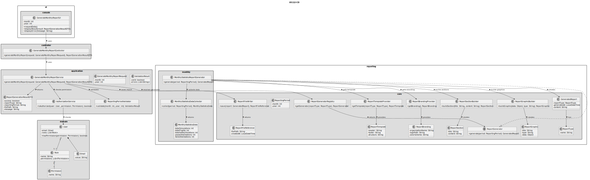
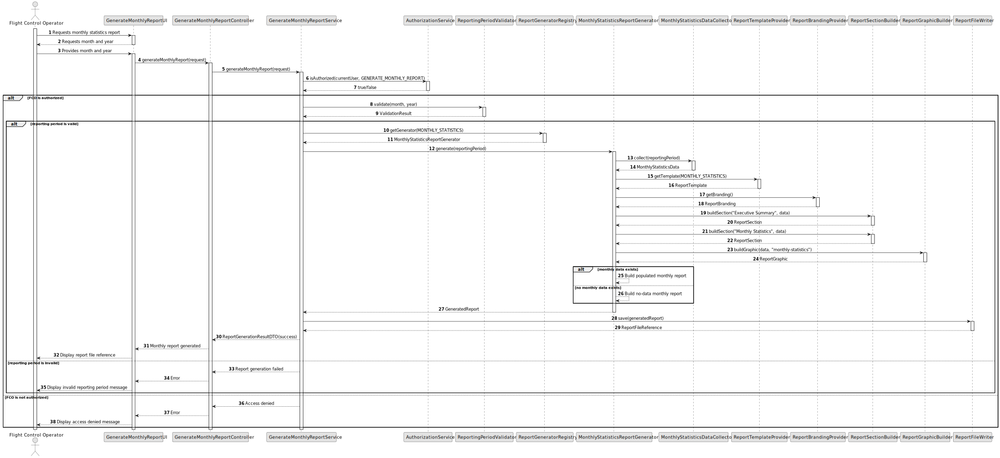

# US112 - Monthly Report Generation

## 3. Design

### 3.1. Responsibility Assignment

The monthly report generation process is divided between the following components:

* **GenerateMonthlyReportUI:** interacts with the Flight Control Operator and requests the reporting month and year.
* **GenerateMonthlyReportController:** receives the report generation request.
* **GenerateMonthlyReportService:** coordinates authorization, period validation, report generation and file storage.
* **AuthorizationService:** verifies whether the current user can generate monthly reports.
* **ReportingPeriodValidator:** validates the selected month and year.
* **ReportGeneratorRegistry:** resolves the correct generator for a report type.
* **MonthlyStatisticsReportGenerator:** generates the monthly statistics report.
* **MonthlyStatisticsDataCollector:** collects the data needed for the monthly report.
* **ReportTemplateProvider:** provides the common report template.
* **ReportBrandingProvider:** provides common branding.
* **ReportSectionBuilder:** builds report sections.
* **ReportGraphicBuilder:** builds report graphical elements.
* **ReportFileWriter:** saves the generated report to a file.
* **ReportGenerationResultDTO:** transfers the result to the UI.

---

### 3.2. Class Diagram

---

### 3.3. Sequence Diagram

---

### 3.4. Applied Patterns

* **Strategy:** each report type can define its own data collection and report generation strategy.
* **Template Method:** common report structure is reused across report types.
* **Registry:** resolves report generators by report type.
* **Builder:** builds report sections and graphics.
* **DTO:** transfers report generation results to the UI.
* **File Writer:** isolates report persistence to file.
* **Validator:** validates the reporting period before generation.

---

### 3.5. Design Remarks

* This US should establish the foundation for future report types.
* Common branding should not be hardcoded in every report generator.
* Monthly statistics data collection should be separate from report formatting.
* The report generator should support a valid no-data report.
* Future reports, such as compliance or incident reports, should reuse the same reporting infrastructure.