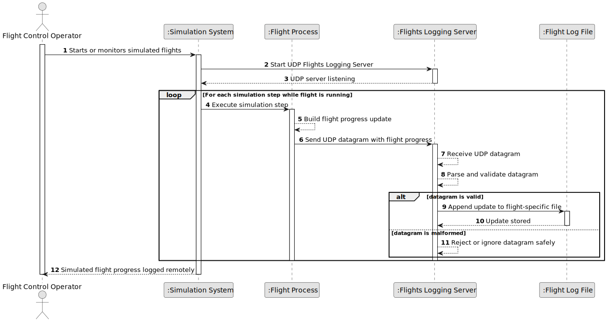

# US113 - External Logging of Flights Progress

## 1. Requirements Engineering

### 1.1. User Story Description

As a Flight Control Operator, I want the remote logging of simulated flights.

This functionality allows the progress of simulated flights to be logged externally by a dedicated network server application called the Flights Logging Server.

The Flights Logging Server is a UDP-based server application. During simulation execution, every running flight process must send an update to the Flights Logging Server at each simulation step. Each update is sent as a UDP datagram.

The Flights Logging Server receives these datagrams and stores the received data in a separate log file for each flight.

---

### 1.2. Customer Specifications and Clarifications

**From the specifications document:**

* A Flight Control Operator wants remote logging of simulated flights.
* A specific UDP-based network server application is required.
* This application is called the Flights Logging Server.
* The Flights Logging Server receives updates from flight processes.
* On each simulation step, every running flight process must send an update to the Flights Logging Server.
* Each update must be sent as a UDP datagram.
* The Flights Logging Server must store the received data in a separate file for each flight.

**From the client clarifications:**

No additional client clarifications are currently available.

---

### 1.3. Acceptance Criteria

* **AC1:** A Flights Logging Server application must exist.
* **AC2:** The Flights Logging Server must be UDP-based.
* **AC3:** The Flights Logging Server must listen for UDP datagrams from flight processes.
* **AC4:** Each running flight process must send one update per simulation step.
* **AC5:** Each update must be sent as a UDP datagram.
* **AC6:** Each UDP datagram must identify the flight.
* **AC7:** Each UDP datagram must identify the simulation step.
* **AC8:** Each UDP datagram must include flight progress data.
* **AC9:** Flight progress data should include at least aircraft position data.
* **AC10:** Flight progress data may include velocity vector, altitude, status and timestamp.
* **AC11:** The Flights Logging Server must parse received UDP datagrams.
* **AC12:** The Flights Logging Server must store received data in a separate file for each flight.
* **AC13:** The same flight must always be logged to the same flight-specific file.
* **AC14:** If a UDP datagram is malformed, the server must reject or ignore it safely.
* **AC15:** A malformed UDP datagram must not stop the Flights Logging Server.
* **AC16:** If the log file for a flight does not exist, the server must create it.
* **AC17:** If writing to a flight log file fails, the server must handle the failure safely.
* **AC18:** UDP transmission failure must not block the simulation indefinitely.
* **AC19:** The system should log or report communication failures where possible.
* **AC20:** This functionality must be consistent with the simulation step synchronization mechanism.

---

### 1.4. Found out Dependencies

* This user story depends on US100, because simulated flights must exist.
* This user story depends on US101, because flight processes produce movement and position updates.
* This user story depends on US103, because updates are associated with simulation steps.
* This user story depends on US105, because the hybrid simulation environment launches flight processes.
* This user story depends on US108, because each flight process sends one update per synchronized simulation step.
* This user story is related to US109 and US111, because logged flight progress may support reporting.
* This user story is related to US114, because the Flights Logging Server is later extended with an HTTP server to visualize simulated flight progress.

---

### 1.5. Input and Output Data

**Input Data:**

* UDP datagram sent by a flight process, including:
    * Flight identifier
    * Aircraft identifier
    * Simulation identifier, if available
    * Simulation step
    * Timestamp
    * Latitude
    * Longitude
    * Altitude
    * Velocity vector, if available
    * Flight process status

**Output Data:**

* In case of successful logging:
    * Flight-specific log file created, if necessary
    * Flight progress update appended to the corresponding file

* In case of malformed datagram:
    * Datagram rejected or ignored
    * Optional internal warning/error entry

* In case of file write failure:
    * Logging failure handled safely
    * Optional internal error entry

---

### 1.6. System Sequence Diagram

**_Other alternatives might exist._**

---

### 1.7. Other Relevant Remarks

* UDP does not guarantee delivery, ordering or duplicate prevention.
* The Flights Logging Server should be robust against missing, duplicated or out-of-order datagrams.
* The simulation should not block indefinitely waiting for UDP logging confirmation.
* Since the server stores one file per flight, the flight identifier must be present and valid in each datagram.
* US114 will reuse the Flights Logging Server by adding an HTTP server and browser-based status page.