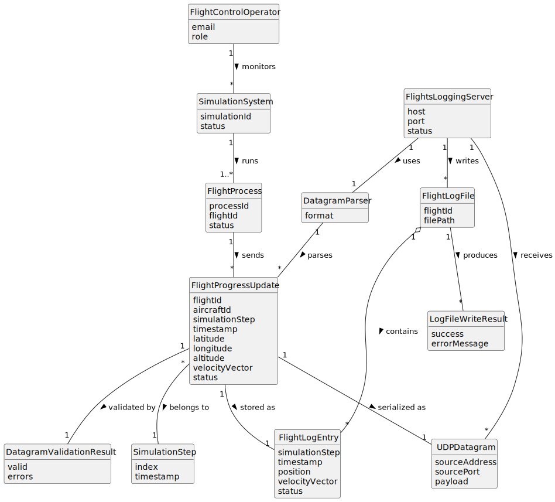

# US113 - External Logging of Flights Progress

## 2. Analysis

### 2.1. Relevant Domain Concepts

The relevant domain concepts for this user story are:

* **Flight Control Operator:** user who wants remote logging of simulated flights.
* **Simulation System:** system executing simulated flights.
* **Flight Process:** process responsible for executing a simulated flight.
* **Simulation Step:** discrete time step of the simulation.
* **Flight Progress Update:** data describing the current progress of a flight at a simulation step.
* **UDP Datagram:** network message sent by a flight process to the Flights Logging Server.
* **Flights Logging Server:** UDP-based network server application that receives flight progress updates.
* **Flight Log File:** file where the progress of one specific flight is stored.
* **Datagram Parser:** component that reads the UDP datagram payload.
* **Datagram Validator:** component that validates the received flight progress update.
* **Flight Log File Writer:** component that appends valid updates to the correct flight file.
* **Malformed Datagram:** datagram that cannot be parsed or does not contain required data.

---

### 2.2. Business Rules

* The Flights Logging Server must use UDP.
* The Flights Logging Server must receive updates from flight processes.
* Every running flight process must send one UDP datagram at each simulation step.
* Each UDP datagram must identify the flight.
* Each UDP datagram must identify the simulation step.
* Each UDP datagram must contain flight progress data.
* The Flights Logging Server must store received data in a separate file for each flight.
* The same flight must always be logged to the same file.
* Malformed datagrams must be handled safely.
* File write failures must be handled safely.
* UDP logging must not block the simulation indefinitely.
* Since UDP is unreliable, the system must tolerate missing or out-of-order updates.

---

### 2.3. Preconditions

* The simulation must be running.
* At least one flight process must be running.
* The Flights Logging Server must be started and listening on the configured UDP port.
* Flight processes must know the UDP host and port of the Flights Logging Server.
* The server must have permission to create and write flight log files.

---

### 2.4. Postconditions

**Successful flight progress logging:**

* The flight process sends a UDP datagram for the current simulation step.
* The Flights Logging Server receives the datagram.
* The datagram is parsed and validated.
* The update is appended to the file corresponding to that flight.

**Malformed datagram:**

* The datagram is rejected or ignored.
* No invalid data is written to the flight log file.
* The server remains available.

**File write failure:**

* The failure is handled safely.
* The server remains available where possible.
* The failure is logged internally, if possible.

**UDP datagram lost:**

* The simulation continues.
* The flight log may miss that step's update.
* Later updates may still be received and stored.

---

### 2.5. Domain Model

