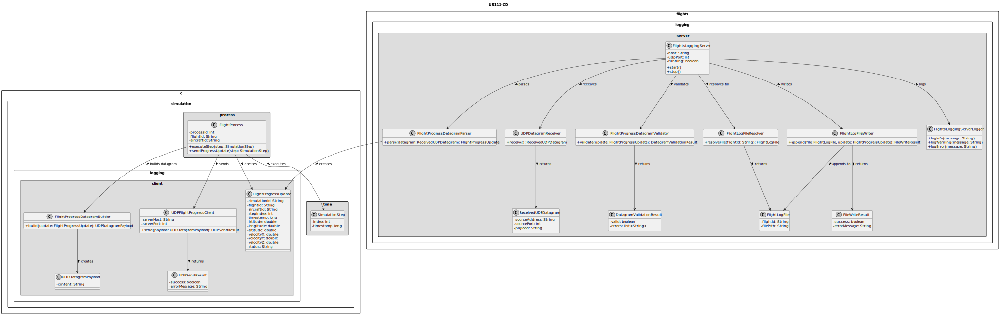
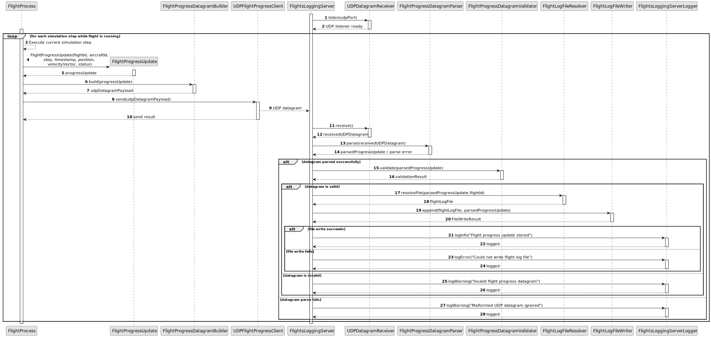

# US113 - External Logging of Flights Progress

## 3. Design

### 3.1. Responsibility Assignment

The external flight progress logging process is divided between the following components:

* **FlightProcess:** sends one UDP datagram at each simulation step while running.
* **FlightProgressUpdate:** represents the flight progress data sent by a flight process.
* **FlightProgressDatagramBuilder:** serializes the progress update into a UDP datagram payload.
* **UDPFlightProgressClient:** sends the datagram to the Flights Logging Server.
* **FlightsLoggingServer:** UDP-based server application that receives flight progress datagrams.
* **UDPDatagramReceiver:** listens for and receives UDP datagrams.
* **FlightProgressDatagramParser:** parses the datagram payload.
* **FlightProgressDatagramValidator:** validates required datagram fields.
* **FlightLogFileResolver:** determines the correct file for each flight.
* **FlightLogFileWriter:** appends valid updates to the flight-specific file.
* **FlightsLoggingServerLogger:** logs malformed datagrams, file errors and server lifecycle events.

---

### 3.2. Class Diagram

---

### 3.3. Sequence Diagram

---

### 3.4. Applied Patterns

* **UDP Client/Server:** flight processes send UDP datagrams to the Flights Logging Server.
* **Message Builder:** creates datagram payloads from flight progress data.
* **Parser:** converts datagram payloads into structured progress updates.
* **Validator:** rejects malformed or incomplete datagrams.
* **File Resolver:** maps each flight to a specific log file.
* **File Writer:** isolates append operations to flight log files.
* **Defensive Network Handling:** tolerates missing, malformed or out-of-order UDP datagrams.

---

### 3.5. Design Remarks

* UDP does not guarantee delivery, so the simulation must not depend on log acknowledgement.
* Every running flight process sends one datagram per simulation step.
* Datagram payloads should be simple and documented.
* A text-based format such as CSV-like or JSON-like payload may be used, depending on implementation constraints.
* The flight identifier is essential because it determines the destination log file.
* The Flights Logging Server should remain running even when invalid datagrams are received.
* US114 will extend the Flights Logging Server with an HTTP server for browser visualization.