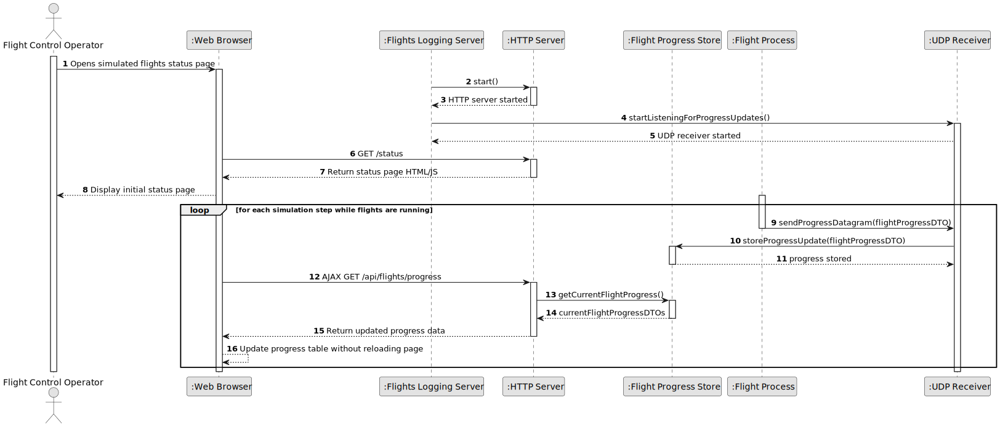

# US114 - Simulated Flights Visualization

## 1. Requirements Engineering

### 1.1. User Story Description

As a Flight Control Operator, I want to view the progress of the simulated flights.

This functionality allows a Flight Control Operator to visualize the progress of running simulated flights through a standard web browser.

The Flights Logging Server application must contain an HTTP server. This HTTP server provides a status page to browser clients. The page displays data about the running simulated flights, possibly as a table, and automatically updates the displayed data to show the step-by-step progress of the simulation.

AJAX must be used to request updated flight progress data from the HTTP server without reloading the page.

---

### 1.2. Customer Specifications and Clarifications

**From the specifications document:**

* A Flight Control Operator wants to view the progress of simulated flights.
* The Flights Logging Server application must contain an HTTP server.
* The HTTP server must provide a status page to clients running a standard web browser.
* Data about running simulated flights may be presented as a table.
* The presented data must be automatically updated to show step-by-step simulation progress.
* AJAX must be used to update the presented data without reloading the page.
* The Flights Logging Server receives flight progress updates from flight processes.

**From the client clarifications:**

No additional client clarifications are currently available.

---

### 1.3. Acceptance Criteria

* **AC1:** The Flights Logging Server must contain an HTTP server.
* **AC2:** The HTTP server must provide a status page.
* **AC3:** The status page must be accessible from a standard web browser.
* **AC4:** The status page must display data about running simulated flights.
* **AC5:** The displayed data may be presented as a table.
* **AC6:** The displayed data must show step-by-step simulation progress.
* **AC7:** The page must update automatically while the simulation is running.
* **AC8:** AJAX must be used to request updated flight progress data.
* **AC9:** AJAX updates must not require reloading the whole page.
* **AC10:** The HTTP server must expose an endpoint that returns current flight progress data.
* **AC11:** Current flight progress data must be derived from data received by the Flights Logging Server.
* **AC12:** The visualization must handle the case where no flights are currently running.
* **AC13:** The visualization must handle delayed or missing updates safely.
* **AC14:** The HTTP server must remain available while UDP logging is receiving flight progress updates.
* **AC15:** Malformed or unavailable progress data must not crash the HTTP server.
* **AC16:** The status page should display enough information for the Flight Control Operator to understand the current progress of each simulated flight.

---

### 1.4. Found out Dependencies

* This user story depends on US113, because the Flights Logging Server receives flight progress updates from flight processes.
* This user story depends on US108, because flight progress is updated step by step.
* This user story is related to US101, because movement and position data are part of the simulated flight progress.
* This user story is related to US102, because safety violation status may be displayed when available.
* This user story is related to US109 and US111, because visualization data and report data may use the same flight progress information.

---

### 1.5. Input and Output Data

**Input Data:**

* HTTP request from a browser client:
    * Request for the status page
    * AJAX request for current flight progress data

* Flight progress data available in the Flights Logging Server:
    * Flight identifier
    * Aircraft identifier
    * Current simulation step
    * Timestamp
    * Current position
    * Altitude
    * Velocity vector, if available
    * Flight process status
    * Last update time
    * Safety status, if available

**Output Data:**

* In case of status page request:
    * HTML status page
    * JavaScript responsible for AJAX updates
    * Optional CSS/styling

* In case of AJAX data request:
    * Current flight progress data in a structured format
    * Empty data response if no flights are running
    * Error response if progress data cannot be retrieved

---

### 1.6. System Sequence Diagram

**_Other alternatives might exist._**

---

### 1.7. Other Relevant Remarks

* This US should not reload the full page for every update.
* AJAX polling is a simple acceptable approach for automatic updates.
* The HTTP server and UDP logging server belong to the same Flights Logging Server application.
* The visualization should read from an internal server-side state derived from received UDP datagrams, not directly from the simulation shared memory.
* This user story does not require a complex map visualization unless the team chooses to implement one.