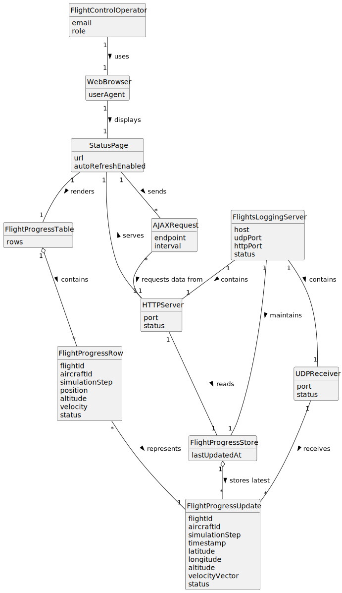

# US114 - Simulated Flights Visualization

## 2. Analysis

### 2.1. Relevant Domain Concepts

The relevant domain concepts for this user story are:

* **Flight Control Operator:** user who views the progress of simulated flights.
* **Flights Logging Server:** application that receives flight progress updates and exposes visualization endpoints.
* **HTTP Server:** server embedded in the Flights Logging Server that provides the status page.
* **Status Page:** browser-accessible page that displays simulated flight progress.
* **Standard Web Browser:** client used by the Flight Control Operator to access the status page.
* **AJAX Request:** asynchronous request used by the status page to fetch updated progress data without full page reload.
* **Flight Progress Store:** internal server-side state containing the latest known progress of each simulated flight.
* **Flight Progress Update:** data received from flight processes, originally through UDP datagrams.
* **Flight Progress Table:** tabular presentation of running flights and their current progress.
* **Automatic Refresh:** repeated AJAX update mechanism that refreshes displayed data step by step.

---

### 2.2. Business Rules

* The Flights Logging Server must contain an HTTP server.
* The HTTP server must provide a browser-accessible status page.
* The status page must display running simulated flight progress.
* The displayed progress must update automatically.
* AJAX must be used for automatic updates.
* The page must not reload completely to update progress data.
* Current visualization data must come from flight progress data received by the Flights Logging Server.
* The visualization must handle no running flights.
* The visualization must handle delayed, missing or incomplete progress updates.
* The HTTP server must remain operational while UDP updates are being received.

---

### 2.3. Preconditions

* The Flights Logging Server must be running.
* The HTTP server must be started.
* The status page must be available.
* A browser client must be able to connect to the HTTP server.
* Flight progress data must either be available or the system must handle an empty state.
* The Flights Logging Server must maintain current flight progress data based on received UDP updates.

---

### 2.4. Postconditions

**Successful status page load:**

* The HTTP server returns the status page.
* The browser displays the initial page.
* The page starts automatic AJAX updates.

**Successful AJAX update:**

* The browser requests current flight progress data.
* The HTTP server returns updated flight progress data.
* The page updates the displayed data without reloading.

**No running flights:**

* The page displays an empty or no-running-flights state.
* The page remains available and may continue polling.

**Progress data unavailable or malformed:**

* The HTTP server handles the issue safely.
* The page displays a meaningful state or keeps the previous valid data.
* The server remains available.

---

### 2.5. Domain Model

