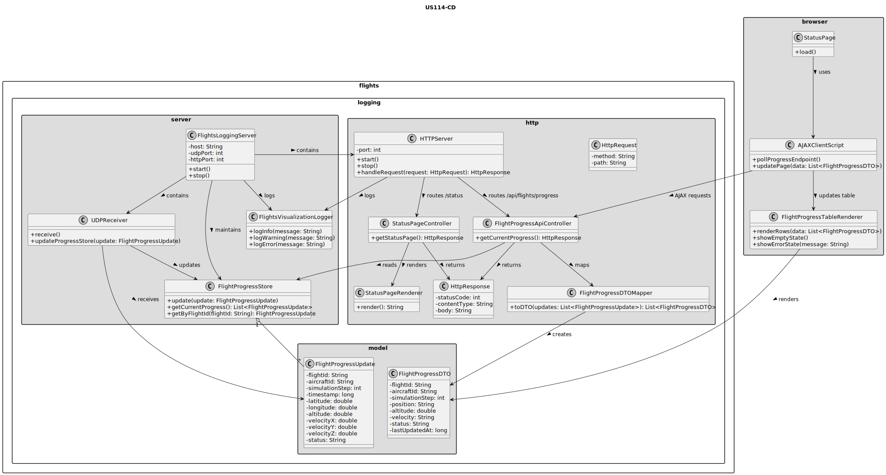
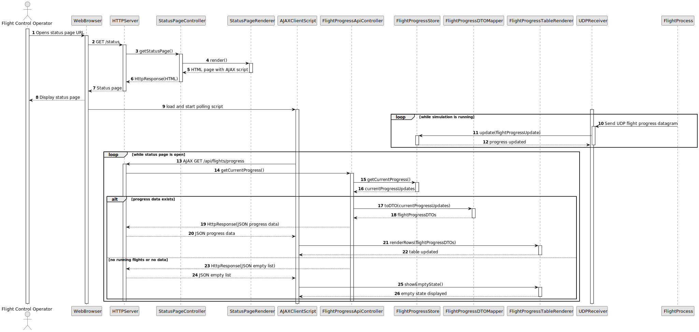

# US114 - Simulated Flights Visualization

## 3. Design

### 3.1. Responsibility Assignment

The simulated flight visualization process is divided between the following components:

* **FlightsLoggingServer:** hosts both the UDP receiver from US113 and the HTTP server required by this US.
* **HTTPServer:** listens for browser HTTP requests.
* **StatusPageController:** handles requests for the status page and flight progress data.
* **StatusPageRenderer:** returns the initial HTML page with JavaScript for AJAX updates.
* **FlightProgressApiController:** returns current flight progress data for AJAX requests.
* **FlightProgressStore:** stores the latest known progress update for each flight.
* **FlightProgressDTOMapper:** converts internal progress data into data suitable for the browser.
* **AJAXClientScript:** periodically requests updated progress data.
* **FlightProgressTableRenderer:** updates the browser table without reloading the page.
* **UDPReceiver:** continues receiving UDP datagrams from flight processes.
* **FlightsVisualizationLogger:** logs HTTP and visualization errors.

---

### 3.2. Class Diagram

---

### 3.3. Sequence Diagram

---

### 3.4. Applied Patterns

* **Embedded HTTP Server:** HTTP server is part of the Flights Logging Server.
* **Controller:** separates status page and API request handling.
* **DTO Mapper:** converts internal flight progress state into browser-safe data.
* **AJAX Polling:** browser requests updated progress data without reloading.
* **Store:** maintains latest flight progress received from UDP datagrams.
* **Renderer:** separates page/table rendering from data retrieval.

---

### 3.5. Design Remarks

* The HTTP server should not read simulation shared memory directly.
* Visualization data should come from the Flights Logging Server's progress store.
* AJAX polling interval should be short enough to show step-by-step progress but not so short that it overloads the server.
* A table is sufficient for the first implementation.
* The page should handle empty, delayed or missing progress updates gracefully.
* The UDP receiver and HTTP server must coexist in the same application without blocking each other.